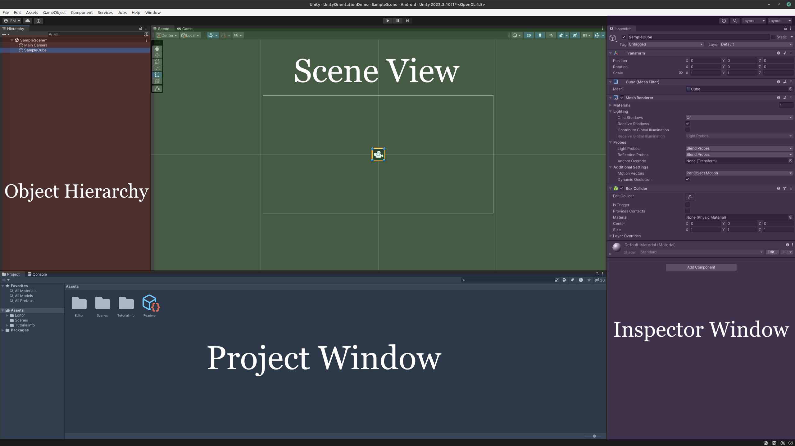

.. _install_to_new:

===========================
Getting Started With Unity
===========================

The Unity Game Engine is an incredible tool for application and game development. It allows for building projects on a multitude of platforms, ranging from mobile to desktop to virtual reality. It also has a large development community where people support each other and build upon each others' work. Unity is an excellent choice for any developer seeking to integrate technologies together or create their dream application.

---------------------------
Creating Your First Project
---------------------------

.. image:: https://img.youtube.com/vi/UpcgKQ234s8/maxresdefault.jpg
    :alt: YouTube Video Explaining Creating a New Unity Project.
    :target: https://youtu.be/UpcgKQ234s8

**[Click on the above image for our YouTube tutorial on Creating a New Unity Project.]**

For our first project, we'll be designing a simple mobile mobile application for Android. Use the following steps to get started:

.. image:: ../../images/UnityLogin.png
  :width: 400
  :alt: An Image of the Unity login screen.

1. Launch Unity Hub and login to your Unity account. If you do not have either of these completed, see :ref:`new_to_install`.

.. image:: ../../images/EmptyProjects.png
  :width: 400
  :alt: An Image of the projects tab in Unity Hub.

2. On the sidebar on the left side of the application, select the *Projects* tab.

3. On the top right of the application, press the button titled *New project*.

.. image:: ../../images/NewProject.png
  :width: 400
  :alt: An Image of a 2D Mobile template for a project in Unity Hub.

4. Under the templates section, select the *2D Mobile* option. You may have to download the template if you have not used it already. The button to download it can be seen on the right side of the application after clicking on the template.

5. Choose a name for your project. It can be anything you like, but we recommend naming it with one word in order to make file access easier. For now, let's call it *MyFirstProject*.

#. Choose the where you'd like to store your project. Be sure to pick a location that is easy to find.
#. Click the *Create project* button in the bottom right corner of the application. This will create the project and launch the editor.

--------------------------
Understanding the Editor
--------------------------

.. image:: https://img.youtube.com/vi/uzsaMCQEnVY/maxresdefault.jpg
    :alt: YouTube Video Explaining the editor.
    :target: https://youtu.be/uzsaMCQEnVY

**[Click on the above image for our YouTube tutorial on Using the Unity Editor.]**

The Unity Editor can seem overwelming at first, but it can actually be broken down into four simple pieces. The image below visualizes these pieces.

^^^^^^^^^^^^^^^
Project Window
^^^^^^^^^^^^^^^

Shaded blue in the image above, the project window contains the file structure of your project. On the left hand side of the window, you will see a sidebar. This sidebar contains the folders located within your project folder. By default, this is the assets folder and the packages folder. 

The assets folder contains many subfolders with useful files in them. These are where you can create and access any folders, scripts, materials, scenes, and prefabs you use in your project. Additionally, if you install any packages from the package manager, a folder for that package will show up here. Do not worry about these terms now, they will be explained later. Common practice is to keep these folders organized, so that you do not lose track of your files. 

Try exploring the project window and seeing what files are contained in it.

^^^^^^^^^^^^^^^^^
Inspector Window
^^^^^^^^^^^^^^^^^

Shaded in purple in the image above, the inspector window contains all the information about the currently selected object. This includes, but is not limited to:

    * Position (X, Y and potentially Z coordinates)
    * Rotation
    * Scale
    * Components attached to the object

Position, rotation, and scale all control where and how the object appears in the scene. Unity uses two different coordinate systems: world coordinates and local coordinates. By default, these values are in world coordinates, which are the general coordinates for the scene. However, if the object is a child of another object, it will use a coordinate system relative to that object called local coordinates. Components are the most variable parts of the inspector, and can have a variety of functions. Each adds an additonal ability or constraint to an object such as a collision box or a script, and can be added by clicking *Add Component* at the bottom of the inspector. They can be removed by pressing the three vertical dots to the right of the components name and clicking *Remove Component*.

Try changing an object's position, rotation, and scale, as well adding and removing a component, to get a good sense of what each of these controls does.

^^^^^^^^^^^^^^^^
Scene View
^^^^^^^^^^^^^^^^

Shaded in green in the image above, the scene view is where you can see what your game world looks like. It allows you to move objects around in the scene and build the application you want. You move around in the scene view by using the view tool, which can be found in the top left of the scene view. There are also the move, rotate, and scale tools in the same menu in the top left that allow you to move, rotate, and scale the selected object, respectively. There are shortcuts for these tools, but they depend on the device you are using (for example, the middle mouse button swaps to the view tool on a desktop). Find more about the shortcuts for your device in the `Unity documentation <https://docs.unity.com/>`_.

Adding new objects to the scene view is as simple as adding them in the object hierarchy or dragging them in from the project window. Finally, just above the scene view there are buttons to pause and play. These allow you to test your game in real time, but note that any changes made while the game is in play mode will be deleted once the game is stopped. While in play mode, the game will be shown in a tab called *Game* in the scene view. You can enlarge and minimize this tab to your liking. Editing should only be done in pause mode, which is the default. Make sure to save your scene after making changes. This can be done using the shortcut *ctrl + S* on PC and *cmd + S* on Mac.

Practice moving around the scene and getting used to the controls. This will help you better understand what is going on in your game.

^^^^^^^^^^^^^^^^^^
Object Hierarchy
^^^^^^^^^^^^^^^^^^
Shaded in red in the image above, the object hierarchy contains any ``GameObject`` s you currently have loaded into the scene. ``GameObject`` s are the building blocks of Unity, and can be created using the "+" button in the top left of the window. See :ref:`oh_to_oc` for more information on ``GameObject`` s. Additionally, you can right click anywhere in the window to open the ``GameObject`` creation menu. There are many built in ``GameObject`` types, but savvy users can create their own type of object if it is not available. The reason for the "hierarchy" in the name is because of the parent-child relationships that objects have. To make an object a child of another, click on the object you want to be the parent in the hierarchy, then right click and create a new object. The created object will be this object's child. 

Try exploring by adding different types of ``GameObject`` s to the scene and creating multiple levels of parents and children until you feel comfortable. Note that you can delete any object you create by right clicking on it in the hierarchy and clicking delete.

---------------------------------
Setting Up For Mobile Development
---------------------------------

Setting up for mobile development is mostly done for you when creating a project using the *2D Mobile* template. However, there are two important menus you should know about that may help you with any last minute configurations you want to make. These are the build settings and project settings menus. The build settings menu can be found by clicking the button labeled *File* on the ribbon at the top of the editor. From there, a dropdown menu will appear, where you can select the *Build Settings* option. In the same ribbon, there is a button labeled *Edit*, where a similar dropdown menu contains a button for *Project Settings*. 

.. image:: https://img.youtube.com/vi/UpcgKQ234s8/maxresdefault.jpg
    :alt: YouTube Video explaining mobile development set-up.
    :target: https://youtu.be/UpcgKQ234s8

**[Click on the above image for our YouTube tutorial on Getting Set Up for Mobile Development.]**

The build settings menu is used for configuring how you want to package the final application. For example, it lets you change what platform you are building for, such as Windows or Android. While you are working on the mobile project, you should keep its build set to Windows. This lets you test the project directly on your computer. However, when you are done developing and want to port it to mobile, you can change the build setting to Android or iOS so it can run on a mobile device. 

The project settings menu allows you to change a multitude of settings for your project, and additionally provides access to settings for any packages you have added to the project. The template has done a good job of setting up the project settings for you, so you don't need to worry about it for this simple tutorial. However, in more advanced tutorials which we will get to later, project settings can be important for optimizing the application.

For now, you can look around at both menus to see what kind of settings exist, but do not change any without knowing what they do, as this could negatively affect your project. If you want to learn more about a specific build or project setting, please check the Unity documentation  for the `project settings <https://docs.unity3d.com/Manual/comp-ManagerGroup.html>`_ and `build settings <https://docs.unity3d.com/Manual/BuildSettings.html>`_.

-----------------
Basic Techniques
-----------------

Here are some basic techniques for mobile development in Unity. Be sure to mess around with all of these techniques until you feel comfortable with them. The `Unity documentation <https://docs.unity.com/>`_ contains additional in depth information about each, but this tutorial should give you all the fundamentals you need to get started. Additonally, watch the video below to see a mobile project created in Unity. You will see videos for the scripting of the project in the scripting section.

.. image:: ../../images/maxresdefault.png
    :alt: YouTube Video showing off a simple mobile game created using Unity.
    :target: https://youtu.be/FGuuR0CaXLw

**[Click on the above image for our YouTube tutorial on Creating a Simple Mobile Game.]**

.. _oh_to_oc:
^^^^^^^^^^^^^^^^
Object Creation
^^^^^^^^^^^^^^^^

``GameObject`` s are the building blocks of Unity, and can be created using the "+" button in the top left of the window. Additionally, you can right click anywhere in the window to open the ``GameObject`` creation menu. There are many built in ``GameObject`` types, but savvy users can create their own type of object if it is not available. An object can be a "parent" or "child" of another object, and each object can have many levels of parents and children, creating "grandparents" and "grandchildren", so to speak. The purpose of these relationships are that some actions, such as transforming an object, will apply to the children of the object as well. For example, if you had a snowman object, but wanted to add a hat on the snowman, if you made the hat a child of the snowman, moving the snowman would move the hat along with it.
``GameObject`` s can have components added to them, such as scripts or colliders, that control how they interact with the scene. 

^^^^^^^^^^^^^
C# Scripting
^^^^^^^^^^^^^

C# is a programming language created by Microsoft that is used in Unity. It is very similar to Java and C++, so if you have any experience with those, you will find it intuitive. Teaching programming is beyond the scope of this tutorial, but there are some aspects specific to Unity scripts you should know about. Scattered Throughout this section are videos explaining the scripts for the mobile project mentioned earlier in this tutorial. Watch them for some additional information. The code used will be linked beneath the video, and you are free to use it to develop your own similar project.

.. image:: https://img.youtube.com/vi/sMAZMGS8JF4/maxresdefault.jpg
    :alt: YouTube Video showing off a the script for the PlayerController in our mobile application.
    :target: https://youtu.be/sMAZMGS8JF4

**[Click on the above image for our YouTube tutorial on the PlayerController Script. See code below.]**

.. literalinclude:: ../../scripts/PlayerController.cs

First, Unity scripts are the most unrestricted way of controlling how an object works, but many of the simple actions that can be implemented using scripts can be done via the inspector instead, avoiding the need for any coding knowledge. If you do want to make an object do something and can't seem to find a way to do it with what is provided in the inspector, *then* you should turn to scripting. To attach a script to a ``GameObject`` you can either drag it from the project window into the inspector while the object is selected, or add it using the *Add Component* button. Double clicking on a script in the project window will open it in your chosen script editor (the default is Visual Studio). A prewritten template for a script is provided by Unity. You will notice that there are two prebuilt functions that are empty: ``Start`` and ``Update``. ``Start`` is called once, when the object is first loaded in, and ``Update`` is called once every frame of the game. There are additional functions built into Unity, and every ``GameObject`` can access these by extending the `MonoBehavior Class <https://docs.unity3d.com/ScriptReference/MonoBehaviour.html>`_ which is automatically done for you. 

.. image:: https://img.youtube.com/vi/V8K47wKSYRM/maxresdefault.jpg
    :alt: YouTube Video showing off a the script for the PlayerController in our mobile application.
    :target: https://youtu.be/V8K47wKSYRM

**[Click on the above image for our YouTube tutorial on the GameController Script. See code below.]**

.. literalinclude:: ../../scripts/GameController.cs

If you ever get stuck while programming, don't forget to use the `C# documentation <https://learn.microsoft.com/en-us/dotnet/csharp/>`_. Also, forums such as the `Unity forum <https://forum.unity.com/>`_ and `Stack Overflow <https://stackoverflow.com/>`_ are excellent resources to expand your scripting knowledge. The best way to improve at scripting is to keep practicing. There are no simple words to make you understand it, it is a journey in and of itself. Luckily, for small scale projects you can often avoid it entirely.

.. image:: https://img.youtube.com/vi/bG2EUjmzxOI/maxresdefault.jpg
    :alt: YouTube Video showing off a the script for the TreasureController in our mobile application.
    :target: https://youtu.be/bG2EUjmzxOI

**[Click on the above image for our YouTube tutorial on the TreasureController Script. See code below.]**

.. literalinclude:: ../../scripts/TreasureController.cs

^^^^^^^^^^^^^^^
Camera System
^^^^^^^^^^^^^^^

The camera system in Unity is very dependent on the application you desire to create. For instance, one project may involve having a player character serve as the main camera, while another may simply have a stationary overhead camera. Regardless of how you want to set up your camera system, Unity has the tools to help you do it. You can add a camera object by creating an empty object and attaching the "Camera" component to it. You can move this camera around in the scene to position it how you'd like, and can even see a pop-up when the camera is selected that shows its perspective. By default, Unity has a camera set up for you when you create a scene. In simple projects, usually the single default camera is enough, but you may have to move it around to get it to your liking.

Practice moving the camera around, and pressing the play button to see how changing the camera position affects the visuals of the game.

^^^^^^^^^^^^^^^
Physics System
^^^^^^^^^^^^^^^

The physics system in Unity is used to control how ``GameObject`` s interact with one another and with the player. There are different physics systems for 2D and 3D games. In this introduction, we'll be refering to the physics used in a 2D game. By default, the physics system is ignored for most objects but this can be changed by adding specific physics-based components to the object. The main two physics-based components are colliders and rigid bodies. Colliders are invisible, and allow objects to collide with other objects. You can use scripting to make events happen when colliders are triggered, making them very useful for interaction. Rigid bodies are what allow physics-based events to occur with the object. You need a rigid body on an object if you want any physics to occur with it **including** collisions. Rigid bodies also are what allows an object to have mass and react to gravity. These two components combined are all you need to get started with Unity's physics system, but there is much more to explore in the 2D physics system that you can explore in the `documentation <https://docs.unity3d.com/Manual/Physics2DReference.html>`_.

You are encouraged to try adding colliders and rigid bodies to objects, and seeing how they respond when the game is played. 

^^^^^^^
Scenes
^^^^^^^

Throughout your Unity practice, the canvas that you have been working on is called the scene. By default, Unity projects begin with a single scene, called *Main Scene*. More complex Unity applications can have multiple scenes, and each has its own set of ``GameObject`` s. While there are ways to have interactions persist between scenes, for the most part scenes remain seperate from one another. Think of scenes like the levels of a game, for example, you could have a different scene for the main menu, level 1, level 2, and so on. For simple applications, most work can be done in a single scene. You can access scenes from the ``~/Assets/Scenes`` in the project window. You will see more about multi-scene applications in a later part of this tutorial.

------------------
Section Review
------------------

In this section, you were introduced to the basics of Unity. You learned how to create a new 2D project and get set up for mobile development. You practiced using the editor, and studied its four main pieces, the project window, inspector view, scene view and object hierarchy. Lastly, you became versed in some basic Unity techniques, and developed the skills necessary to move forward into more advanced techniques, which you will learn about in the next section. Keep up the hard work!

^^^^^^^^^^^^^^^^^^^^^^^
Module Self-Assessment
^^^^^^^^^^^^^^^^^^^^^^^

.. quizdown::

   ---
   shuffle_answers: false
   ---

   ## Which of these is not one of the four main aspects of the Unity Editor?

   > Visit the "Understanding the Editor" section.

   1. [ ] Scene View
        > The correct answer is Script Manager.
   2. [ ] Inspector Window
        > The correct answer is Script Manager.
   3. [ ] Project Window
        > The correct answer is Script Manager.
   4. [x] Script Manager
   5. [ ] Object Hierarchy
        > The correct answer is Script Manager.

   ## Which of these is not a built-in class in Unity?

   > Watch the videos contained in the "C# Scripting" section.

   1. [ ] GameObject
        > The correct answer is Visual.
   2. [ ] Time
        > The correct answer is Visual.
   3. [ ] Input
        > The correct answer is Visual.
   4. [x] Visual

   ## Which of the following is not a tool found in the Scene View?

   >Visit the "Scene View subsection."

   1. [x] Transform
   2. [ ] Scale
        > The correct answer is Transform.
   3. [ ] Move
        > The correct answer is Transform.
   4. [ ] Rotate
        > The correct answer is Transform.