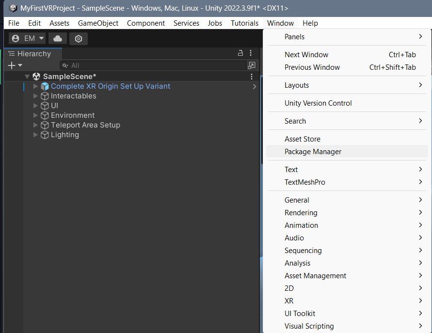
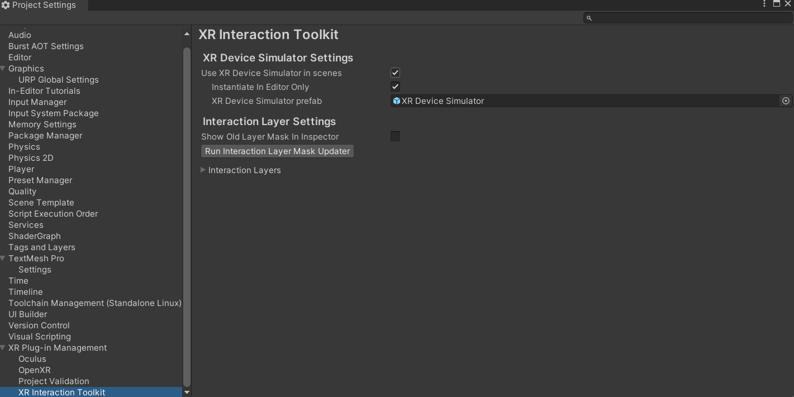
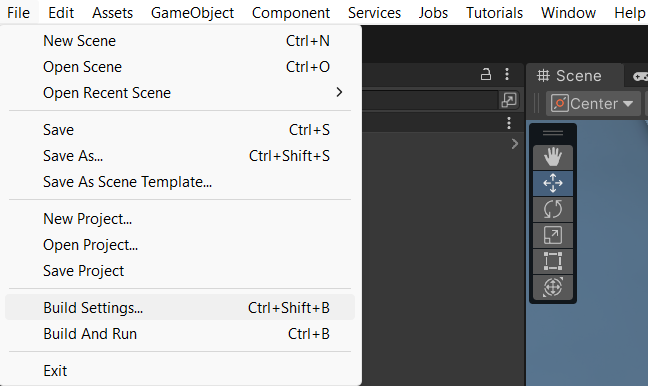
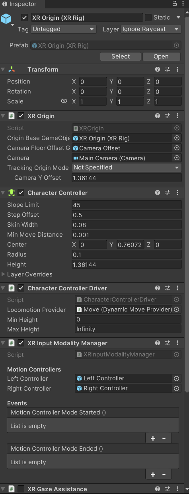
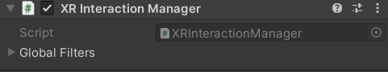
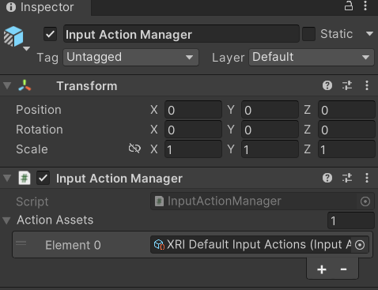
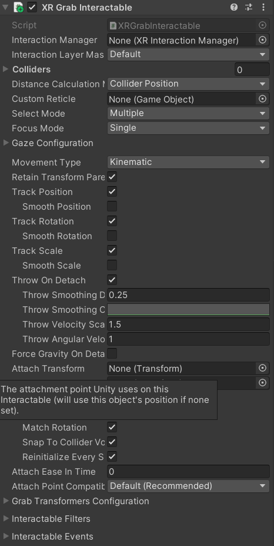
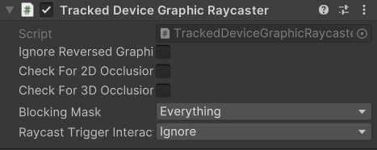

====================
Unity VR Development
====================

--------------------------------
Introduction to VR Development
--------------------------------

Virtual Reality(VR) is a rapidly expanding technology that is becoming increasingly integrated into everyday life. As such, application development for this medium is at an all-time high. Learning how to create applications for VR is important now more than ever, and Unity is the best tool for beginning this journey. Follow this tutorial closely, as the techniques learned here will not only be critical to being successful in future tutorials, but also in building skills for the incoming VR boom.

-----------
Why Unity?
-----------

.. image:: ../../images/UnityLogo.png
  :width: 400
  :alt: An image of the Unity logo.

As stated in the introduction, Unity will be the tool of choice VR Development now and in the near future. Unity is *the* best pick for anyone looking to develop for VR for a multitude of reasons. First, Unity has a large variety of actively updated packages to facilitate building out a VR app, something that other engines lack. Second, Unity has multiple ways to build and test a VR application, by controlling the build platform of the project. Unity VR projects can be built as standalone Android applications, meaning that they do not require a computer to be connected to the headset to run the app. They can also be built for Windows, allowing them to run alongside a computer for easier testing and modification. Lastly, Unity was chosen due to its thriving development community and ease of access, both of which offer newcomers a level of support that you would be unlikely to come across elsewhere. These are the main reasons Unity was chosen, and why most VR developers opt to use Unity as well.

.. _to_create_vr:
----------------------
Creating a VR Project
----------------------

.. image:: ../../images/NewVRProject.png
    :alt: YouTube Video Explaining Creating a New Unity VR Project.
    :target: https://youtu.be/rIEH4bI-lFE

**[Click on the above image for our YouTube tutorial on Creating a New Unity VR Project.]**

Creating a new Unity project for VR is very similar to the way you created the mobile project in the last section. Do the following to get your VR project created:

.. image:: ../../images/UnityLogin.png
  :width: 800
  :alt: An image of the Unity login screen.

1. Launch Unity Hub and login to your Unity account. If you do not have either of these completed, see :ref:`new_to_install`.

.. image:: ../../images/EmptyProjects.png
  :width: 800
  :alt: An image of the projects tab in Unity Hub.

2. On the sidebar on the left side of the application, select the *Projects* tab.

3. On the top right of the application, press the button titled *New project*.

.. image:: ../../images/NewVRProject.png
  :width: 800
  :alt: An image of a 2D Mobile template for a project in Unity Hub.

4. Under the templates section, select the *VR Core* option. You may have to download the template if you have not used it already. The button to download it can be seen on the right side of the application after clicking on the template.

5. Choose a name for your project. It can be anything you like, but we recommend naming it with one word in order to make file access easier. For now, let's call it *MyFirstVRProject*.

6. Choose the where you'd like to store your project. Be sure to pick a location that is easy to find.

7. Click the *Create project* button in the bottom right corner of the application. This will create the project and launch the editor, which will contain a pre-made sample scene for you to start with.

-------------------
Pre-Project Setup
-------------------

Unlike the simple mobile game you saw in :ref:`install_to_new`, a VR project will require a larger setup process before you begin work. These steps are not optional, and should be followed closely.

^^^^^^^^^^^^^^^^^^^^
Essential Packages
^^^^^^^^^^^^^^^^^^^^

.. image:: https://img.youtube.com/vi/P67a67jhWAY/maxresdefault.jpg
    :alt: YouTube Video Explaining Creating a New Unity VR Project.
    :target: https://youtu.be/P67a67jhWAY

**[Click on the above image for our YouTube tutorial on Verifying VR Packages.]**

There are some packages you will need for this project, and since you likely haven't used the Unity package manager yet, the following steps will teach you how to verify the packages you need for this project are properly installed, and how to install them if they are not. It will also serve as a template for installing any Unity package from the package manager:

1. Launch Unity Hub and login to your Unity account.

#. On the sidebar to the left of the application, select the *Projects* tab.

#. Open the project you created in :ref:`to_create_vr`.

#. On the ribbon in the top left of the editor, select the *Window* option. This will open a drop-down menu with several options.

5. In the drop-down menu that appears, select the *Package Manager* option. This will open the Unity package manager in a new window. The Unity package manager is used to install, disable, update, and remove packages from a project.

#. Within the package manager, press the drop-down labeled `Packages:`. This should bring up a menu of sources where packages are located. Select the `Packages: In Project` option. You will now see a list of the packages currently installed for this project appear. 

.. image:: ../../images/package_manager_select.png
  :width: 800
  :alt: An image of the necessary packages in the package manager of the Unity Editor.

7. Verify that the following packages are installed in your project. If all of them are installed, you can skip the rest of these steps - however, the steps below will teach you how to install a package, so if you plan on using additional packages for your project, it is useful information. 

    * XR Interaction Toolkit

    * XR Core Utility

    * XR Legacy Input Helpers

    * XR Plugin Management

    * OpenXR Plugin

    * Oculus XR Plugin

.. note::
    Many other VR integration packages exist in Unity, such as the Oculus integration package. However, these packages are mostly limited to the specific brand headset that the package is for. The Oculus integration package only works on Meta Quest devices, for example. The benefit of using the XR toolkit instead is that it allows the application to be run on almost any VR capable device. 
    
    The only caveat with using the XR toolkit is that you lose access to some headset-specific features. This is an acceptable compromise for this set of tutorials, which aims to teach the basics of Unity VR development for a wide variety of devices. If you instead wish to use headset-specific features in your project, you will have to learn how to use their proprietary packages instead. 

8. If you found that any of the previously listed packages were missing from your project, Click on the "+" button in the top left corner of the package manager. This will present you with options to add a package to your project.

#. Select the *Add package by name...* option. This will prompt you to input the name and version of the package you would like to add. 

#. Enter the name of the missing package and leave the version field blank. Ensure the information you provided is correct, and press the *Add* button. This will install the most recent version of the package to your project.

#. Repeat steps 8 through 10 until all the missing packages are installed. You have now successfully installed the packages you will need for VR development.

^^^^^^^^^^^^^^^^^^^^^^^^^^
Project Settings
^^^^^^^^^^^^^^^^^^^^^^^^^^

.. image:: https://img.youtube.com/vi/w6atqSE8-kw/maxresdefault.jpg
    :alt: YouTube Video Explaining VR Project Settings.
    :target: https://youtu.be/w6atqSE8-kw

**[Click on the above image for our YouTube tutorial on VR Project Settings.]**

If you recall the :ref:`to_mobile_setup` subsection of module one, you will remember the mention of *Project Settings* and *Build Settings*. While the simple mobile application that was made in that module did not require any modification of these settings, that is not the case for this more advanced tutorial. Some of the changes found in this and the following section are necessary for your project to run correctly, so please make sure to do all of them.

#. Launch Unity Hub and login to your Unity account.

#. On the sidebar to the left of the application, select the *Projects* tab.

#. Open the project you created in :ref:`to_create_vr`.

#. On the ribbon in the top left of the editor, select the *Edit* option. This will open a drop-down menu with several options.

.. image:: ../../images/project_settings.png
  :width: 400
  :alt: An image of the project settings tab in the Unity Editor.

5. In the drop-down menu that appears, select the *Project Settings* option. This will open the settings for your project in a new window. There are a few changes you will need to make to the default settings to allow your development to run smoothly.

6. In the sidebar on the left side of the project settings menu, select the *XR Plugin-Management* option. 

.. image:: ../../images/xr_plugin_management.png
  :width: 800
  :alt: An image of the XR Plugin Management settings in the settings menu of the Unity Editor.

7. In the settings that appear for this package, make sure that the box labeled *Initialize XR on Startup* is checked for all platforms.

#. To the left of *XR-Plugin Management* option that you selected before, there is a right-facing arrow. Click this arrow. This will reveal additional options for the package.

#. In the list of new options that appear, select the *XR Interaction Toolkit* option.

10. In the settings that appear for this package, check the box labeled *Use XR Device Simulator in scenes*. This may prompt you to add the *XR Device Simulator* prefab to your project. If this appears, select OK. This will allow you to test your game from the the computer without using a headset by using the simulator prefab mentioned earlier when the game is run in play mode.

#. In the same menu where you found the *XR Interaction Toolkit* option, select the *Project Validation* option. 

.. image:: ../../images/project_validation.png
  :width: 800
  :alt: An image of the Project Validation settings in the settings menu of the Unity Editor.

12. In the settings that appear, select the *Windows, Mac, Linux settings* tab, and check the box labeled *Show All*. Do the same for the *Android settings* tab. This will display any issues found with your project and can help you fix any that occur. This tab is extremely useful for finding bugs in your project, so refer back to it if you ever have errors compiling your project. 

#. Those are all the project settings you need to move froward, but feel free to peruse the menus and see what otehr options there are. Just be careful, because checking certain options could mess with your projects ability to run correctly. The next section will help you set up your projects build settings.

^^^^^^^^^^^^^^^^^^^^
Build Settings
^^^^^^^^^^^^^^^^^^^^

.. image:: https://img.youtube.com/vi/CIyGtEtkOu4/maxresdefault.jpg
    :alt: YouTube Video Explaining VR Build Settings.
    :target: https://youtu.be/CIyGtEtkOu4

**[Click on the above image for our YouTube tutorial on VR Build Settings.]**

At this point in the process, you will have to decide how you want to build your project. VR projects can be built to be run on a standalone headset, or in tandem with a PC. Both build methods have their merits, but the tutorial here will teach you how to develop for a standalone Android device, as this option is more widely accessible. Android does not require a powerful computer, nor does it require a constant connection to the computer to run. If you wish to create a non-standalone application, you will have to adjust your build and project settings according to your desired platform. You can find out more in the Unity documention on `Platform Development <https://docs.unity3d.com/Manual/PlatformSpecific.html>`_.  Otherwise, follow the steps below to set your project up for an Android build:

#. Launch Unity Hub and login to your Unity account.

#. On the sidebar to the left of the application, select the *Projects* tab.

#. Open the project you created in :ref:`to_create_vr`.

#. On the ribbon in the top left of the editor, select the *File* option. This will open a drop-down menu with several options.

5. In the drop-down menu that appears, select the *Build Settings* option. This will open the build settings in a new window. This is where you will change your desired platform to Android.

#. In the window that appears containing the build settings, look to the bottom right corner of the window. You should see a list titled *Platform*, with multiple clickable options below it. Select the *Android* option.

.. image:: ../../images/android_build.png
  :width: 800
  :alt: An image of the build settings window with the Android platform selected.

7. In the same window, in the bottom right corner, there will be a button the says *Switch Platform*. Click this button. This will change your platform to Android and cause the editor to rebuild the domain for this new platform. This could take a little bit to do.

.. note::
    If you ever need to change the build platform for your project, it is a good idea to do this when you first create the project or early on in its development. This is because changing platforms can take a very long time for large projects and increases the likelihood of bugs appearing when the domain is rebuilt. If you do have to change your build late into development of your application, be ready to wait a while for the conversion and to sift through small bugs that appear when the platform change occurs.

8. That is all you have to do to change your build platform. While you changed your build to Android here, the process is the same for switching to any platform; Select your desired platform from the *Platform* list before clicking the *Switch Platform* button. 

When you are ready to actually build your project, return to the build settings window and select the *Build* button. Since your project is for Android, this will produce an APK file that you can then store on your headset and access to run the project. Building the APK can take some time, so it is good practice to perform most basic testing in the Unity editor using the *XR Device Simulator*, building infrequently and only using the actual headset when needed for more complicated testing.

--------------------------
Advanced Techniques in VR
--------------------------

VR development has a lot more moving pieces than traditional application development. Having a strong foundation in the Unity basics you learned about in the last section is a prerequisite to understanding the more advanced techniques discussed here. If you feel you need more practice in the basics, don't hesitate to return to :ref:`install_to_new` to refresh. There is no shame in extra practice. If you think you have mastered the previous module and are ready to move on, continue reading to delve in to the advanced techniques found in VR development.

^^^^^^^^^^^^^^^^^^^^^^^^^^^^^^
Interactors and Interactables
^^^^^^^^^^^^^^^^^^^^^^^^^^^^^^

The *XR Interaction Toolkit* uses an interactor-interactable relationship to define interactions in VR. Objects can be designated as either an interactor or an interactable, and gain access to different attributes as a result. There are lots of available interactors and interactables in the package, but for this tutorial you will only be exploring a few. If you want to delve deeper into the other available interactors and interactables, check out the `Unity documentation on the XR Interaction Toolkit <https://docs.unity3d.com/Packages/com.unity.xr.interaction.toolkit@1.0/manual/index.html>`_.

^^^^^^^^
XR Rig
^^^^^^^^

The *XR rig* is a prefab object included in the *XR Interaction Toolkit*. This object allows the user to interact with the virtual environment by providing input in the form of sight, sound, and touch. The *XR rig* is how the user connects their actions in the headset to the Unity application. As such, it is absolutely necessary for any VR application. The *XR rig* has two child objects called *Camera Offset* and *Locomotion System* that provide the previously mentioned inputs through their own child objects and their attached scripts. There are a lot of parameters you can change within the *XR rig* object and its child object, and exploring these can further customize your VR control scheme, but the default parameter settings are completely acceptable for most use cases.

You can access the XR rig individually by searching for *XR Origin (XR Rig)* in the assets folder of the project manager, however, the template project provided by default when using the Unity VR Core project type has an prefab called *Complete XR Origin Set Up Variant* that already has the *XR rig* as a child object, and has it already set up for use alongside other useful objects you will learn more about in the upcoming subsections. This tutorial will be using this prefab instead, since it facilitates set-up, and provides additional actions for the player. If you wish to set up your own player rig without the extra objects, you can always use the *XR rig* by itself.

^^^^^^^^^^^^^^^^^^^
XR UI Input Module
^^^^^^^^^^^^^^^^^^^

.. image:: ../../images/xr_ui.png
  :width: 500
  :alt: An image of the XR UI Input Module component.

Included in the afformentioned *Complete XR Origin Set Up Variant* is an empty child object called *EventSystem*. This object has a script attached to it called the *XR UI Input Module*. This script allows the player to use UI elements in virtual reality. The script has multiple parameters set up to control UI actions, connecting each to a preset for that specific action. These actions, like *Point Action* and *Left Click Action* allow you to control what happens when that action occurs. However, the default presets for these actions are intuitive and should remain as-is for most projects. 

.. note::
    If you add the *XR UI Input Module* to another object, you will have to manually add these presets for the actions, which can be found by searching *XRI UI* in the project window search bar and dragging each Input Ation Reference that appears to its corresponding parameter in the script component. This can be complicated, so it is highly recommended to just use the *Complete XR Origin Set Up Variant* prefab instead.

^^^^^^^^^^^^^^^^^^^^^^^
XR Interaction Manager
^^^^^^^^^^^^^^^^^^^^^^^

Also included in the *Complete XR Origin Set Up Variant* is another empty child object called *XR Interaction Manager*. This object has a script attached to it that shares its name. This script essentially marks the object that it's attached to as an interactor object. In this case, since the *XR Interaction Manager* is a child object of the *Complete XR Origin Set Up Variant*, this property is extended to it. What this does is lets the player perform specified VR interactions like grabbing or climbing on specified interactable objects. If you want another object to be an interactor, you can simply add this script as a component to that object as well. For most basic VR projects, the player character is the only interactor, and every other usable object is an interactable.

^^^^^^^^^^^^^^^^^^^^^
Input Action Manager
^^^^^^^^^^^^^^^^^^^^^

The last big piece included in the *Complete XR Origin Set Up Variant* is the *Input Action Manager*. Similar to the *XR Interaction Manager*, the script for the *Input Action Manager* is attached to an empty object of the same name, and because that empty object is a child of the *Complete XR Origin Set Up Variant* the property is extended to it. The purpose of this script component is to control what input actions are enabled and disabled. The script has a list parameter where you can put all the input actions you intened to use. You can use the ``InputActionManager`` class to enable or disable them. The *Complete XR Origin Set Up Variant* already has the default actions in there, so you don't need to worry about it, but if you are creating your own input action controller you will have to insert the actions you want into the list.

^^^^^^^^^^^^^^^^^^
Grab Interactions
^^^^^^^^^^^^^^^^^^

Grabbing objects in VR is an important aspect of many applications, so understanding how to implement it is beneficial. This is also where you will learn how to make objects interactables, as mentioned in the previous section. There are a few necessary components to you will need create a robust grab system. The first two components are some that you've seen before, the rigid body component and the collider component. The only difference from the versions of these components you saw in the :ref:`to_physics` section is that these are the 3D versions. They work similarly to the ones you learned about previously, but if you want to learn about the syntactical differences, you can learn more about the 3D-specific versions in the `3D Physics <https://docs.unity3d.com/Manual/PhysicsOverview.html>`_ Unity documentation. 

The next component you'll need is the *XR Grab Interactable* script. This script is included in the XR Interaction Toolkit and is the counterpart to the *XR Interaction Manager* script from above. This script serves as a marker, making the object its attached to an interactable. In doing so, whenever an interactor object performs a grab interaction on the interactable, the interactable will react and link itself to the interactor, as if it were grabbed.

^^^^^^^^^^^^^^^^^^^^^^^^^^^^^^^^^
Tracked Device Graphic Raycaster
^^^^^^^^^^^^^^^^^^^^^^^^^^^^^^^^^

The *Tracked Device Graphic Raycaster* is used to define objects as UI interactables, and works in tandem with the *XR UI Input Module* mentioned earlier. This script lets the object it's attached to be treated as a UI elemenent, meaning that the player can perform actions such as pressing a button on it or moving a slider. Without this script, the player will be unable to interact with the UI elements, so make sure to add it to any elements you want the player to be able to interact with. 

There are a lot of parameters you can change on this script, but the main one you need to worry about is the *Interaction Manager*. If you leave this parameter as empty (the default), Unity will find one for you. When you only have one *XR Interaction Manager*, you can leave this slot open, but if you have more than one, you need to specifically select one of them to prevent a random selection. If you are working from the sample project provided, the *Complete XR Origin Set Up Variant* is the only object with an *XR Interaction Manager* attached to it (via its child) so you can leave this blank.

-----------
VR Maze
-----------

Now that you have learned about the most important techniques used in Unity VR development, you should experiment with developing your own VR application. If you ever find yourself lost in the process, look back to this module to jog your memory. If you want to implement anything that is not discreetly mentioned in this section, feel free to explore the `Unity VR documentation <https://docs.unity3d.com/Manual/VROverview.html>`_ to learn more niche topics. Included in this section is an example project, *VR Maze*. This project is larger in scale than anything you are expected to make at this point in your learning, but can serve as inspiration for your own projects and can show off the posibilities for application development when performed by a seasoned Unity developer. Keep reading to find out more about this project.

The maze project was developed by Robert Licata and Niall Pepper, who have graciously allowed it to be used as an example VR project for this tutorial. The goal of the project was to experiment with procedurally generated mazes and analyze the responses of players to these mazes. The maze project initally began as a 2D Unity project, but was reworked into virtual reality to study the change in participant responses from 2D to VR. The results of the study provide insight into the efficacy of VR as an alternative application platform for cognitive applications.

The application itself is unique from any project you have seen previously in this set of tutorials. Most of the game is generated when the user actually begins playing the game, and this is accomplished using Unity prefabs and a complex algorithm to define the maze structure. Currently, the player uses standard VR controls to navigate through the maze, with the goal of reaching checkpoints scattered throughout. Upon reaching all checkpoints, the maze is completed and the users final completion time is presented. Later, you will see an attempt at integrating this maze application with physiological sensors, and an analysis of how the new control scheme, one where the players electromyographic signals control their movement, affects their maze completion time. For now, let this maze project spark your creativity for your own VR project, and do not worry about the physiological sensors, you will learn all about them in :ref:`int_to_sensors`.

---------------
Section Review
---------------

In this module, you learned how to develop Unity applications for a virtual reality device. You practiced building a Unity VR project for Android, installing packages from the package manager, and properly setting up your build and project settings. You identified the key techniques used with the *XR Interaction Toolkit* and how the interactor-interactable relationship defines VR iteractions. You recoognized useful objects for VR development such as the *XR Rig* and the *Complete XR Origin Set Up Variant* that came with the sample. Lastly, you were introduced to the *VR Maze* project, and experimented with creating your own virtual reality project in Unity. You are now ready to move on to  the next section and learn about physiological sensors. You will be combining your knowledge of Unity and these sensors later in the course, so look forward to that. Thank you for your hard work, you are doing great!

^^^^^^^^^^^^^^^^^^^^^^^
Module Self-Assessment
^^^^^^^^^^^^^^^^^^^^^^^

.. quizdown::

   ---
   shuffle_answers: false
   ---

   ## What is the purpose of the *XR Rig* gameObject?

   > Re-read the sub-section on the XR Rig.

   1. [x] To provide a vessel for the player to interact with the VR environment.
   2. [ ] To let the player use UI elements in VR.
        > The correct answer is to provide a vessel for the player to interact with the VR environment.
   3. [ ] To make the player an interactable so that they can be grabbed.
        > The correct answer is to provide a vessel for the player to interact with the VR environment.

    ## Why is the *Tracked Device Graphic Raycaster* needed?

    > Re-read the sub-section on the Tracked Device Graphic Raycaster.

    1. [ ] It lets the player grab interactables.
        > The correct answer is it marks the attached object as a UI element.
    2. [ ] It lets the player interact with UI elements.
        > The correct answer is it marks the attached object as a UI element.
    3. [x] It marks the attached object as a UI element.

    ## Which of the following is *not* a script component?

    > One of these is a package. Re-read the Essential Packages sub-section.

    1. [x] XR Interaction Toolkit
    2. [ ] XR UI Input Module
        > The correct answer is Complete XR Origin Set Up Variant.
    3. [ ] XR Grab Interactable
        > The correct answer is Complete XR Origin Set Up Variant.
    4. [ ] XR Interaction Manager
        > TThe correct answer is Complete XR Origin Set Up Variant.

    ## What is the relationship that defines interactions in the *XR Interaction Toolkit*?

    > Re-read the sub-section on Interactors and Interactables.

    1. [ ] Player-Object
        > The correct answer is Interactor-Interactable.
    2. [x] Interactor-Interactable
    3. [ ] Script-Component
        > The correct answer is Interactor-Interactable.
    4. [ ] XR-Rig
        > The correct answer is Interactor-Interactable.

    ## Where in the editor should you go to help debug your project?

    > Re-read the Project Settings section.

    1. [ ] Package Manager >> In Project
        > The correct answer is Project Settings >> Project Validation.
    2. [ ] Project Setting >> Use XR Device Simulator in scenes
        > The correct answer is Project Settings >> Project Validation.
    3. [ ] Build Settings >> Switch Platform
        > The correct answer is Project Settings >> Project Validation.
    4. [x] Project Settings >> Project Validation
        