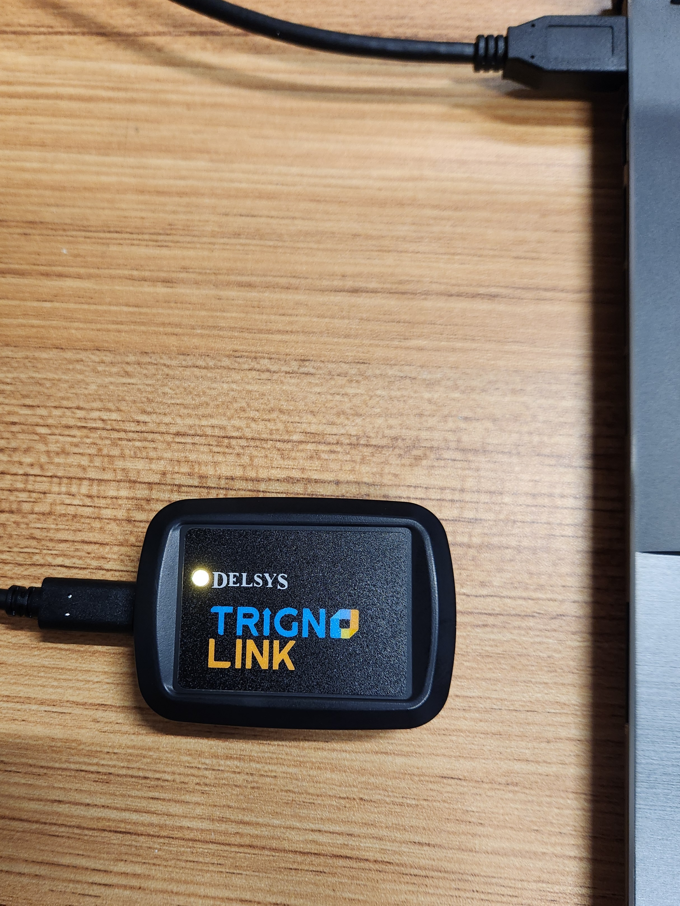
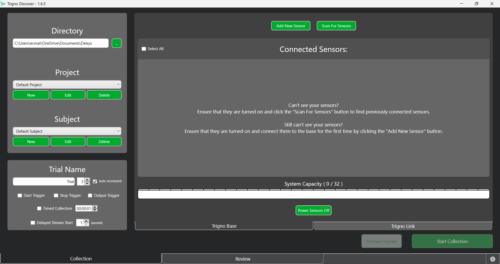
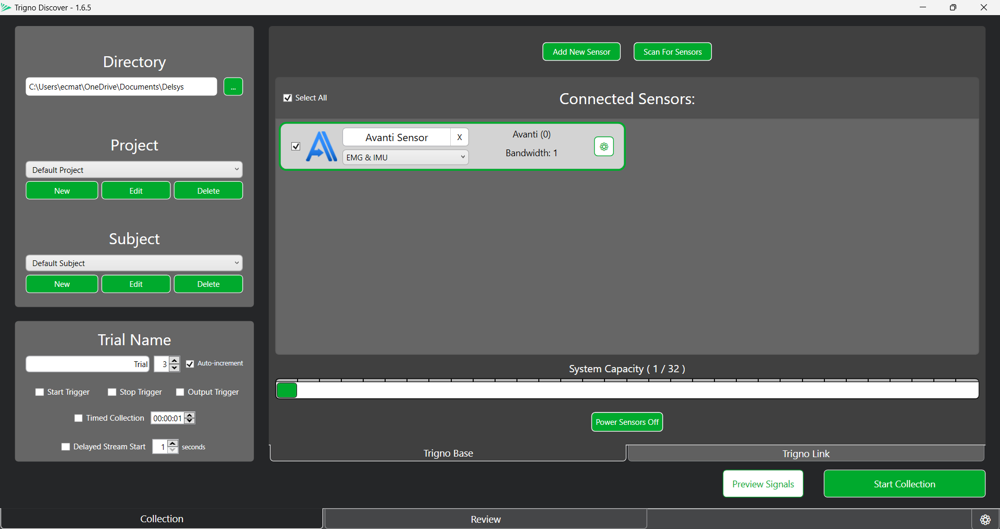
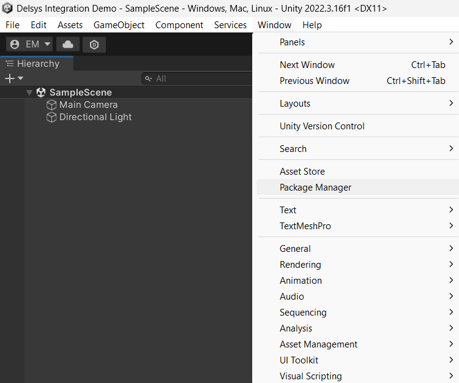

============================================
Data Collection with Physiological Sensors
============================================
Now that you have explored both Unity and the various types of physiological sensors, it's time to begin integrating them together. You will do this using the **Delsys Trigno Link**, a device that allows multiple physiological sensors to be connected to a single computer via bluetooth. This tutorial will include an in-depth tutorial on how to connect and setup the Trigno Link, and how to collect data from the sensors attached to it. You will start simple, and develop a simple, console-based based Unity application that prints out the data recieved rom the sensors. The main goal of this module is to ensure that you can effectively use and read from the Trigno Link, and access that data in Unity. Once you have these basics down, the next module wll move on to more complex integration techniques using VR.

------------------------------
Setting up the Trigno Link
------------------------------

.. image:: ../../images/TrignoLinkPromo.png
  :width: 800
  :alt: An Image of the Trigno Link.

The Trigno Link is the key to integrating physiological sensors with Unity. While the Trigno Link is not required to receive data from only Trigno sensors, it is necessary to use *both* Trigno and third-party sensors congruently. As such, it is important to understand how the Link works in order to seamlessly integrate both Delsys and third-party sensors simultaneously. 

^^^^^^^^^^^^^^^^^^^^^
Trigno Link Design
^^^^^^^^^^^^^^^^^^^^^

The first step to effectively using the Trigno Link is knowing how it works. The Trigno Link is a wireless device that connects to a computer via a USB-C dongle. Two to thirty-two sensors can be simultaneously linked to the Trigno Link. Essentially, these sensors concurrently transmit their raw data to the Link, where it keeps their data streams separate and sends them to the computer for use. This data can come from a variety of sensors, including but not limited to any of the sensors mentioned in the previous module. Crucially, this device is not locked to only Delsys products, but supports many third-party options, vastly increasing its versatility. You will need the **Trigno Wireless BioFeedback System** in order for the Link to provide the synchronized data. You will connect the device to a computer using the USB-A side of the included cable, and attach the USB-C side to the female plug on the Link. An LED light will glow on the top of the Link once it has been connected. The color of this light can help determine the current feedback state of the Link. You can find a list of the different feedback states and their corresponding light colors in the `Trigno Link User Guide <https://delsys.com/downloads/USERSGUIDE/trigno/link-communication-module.pdf>`_.

^^^^^^^^^^^^^^^^^^^
Getting Started
^^^^^^^^^^^^^^^^^^^
Upon unboxing your Trigno Link, you'll be greeted to the compact device, a USB-C dongle, a quickstart guide, and a user guide. It is *highly* recommended to read the quickstart guide and user guide in conjunction with the tutorial presented here, as this will give you the most comprehensive understanding possible. Additionally, you can use these resources to troubleshoot any issues you have with the product. 

.. note::
    In order to use the Trigno Link, you must have at least two compatible physiological sensors, with at least one being a Trigno Sensor (Which you will already be using due to the requirement of the Trigno Wireless BioFeedback System's usage). The link itself does not generate any data, instead it allows data from *other* sensors to be read in tandem. All Delsys made sensors are natively supported, alongside a list of third-party sensors that you can find `here <https://delsys.com/trigno-link/>`_ in the *Applications* section.

To begin using the Link, you will need the *Trigno* Discover application, a piece of Delsys software used to monitor and receive data from the sensors on a computer. This software can be found `here <https://delsys.com/activation/>`_. As of writing this tutorial, the current version of this software is 1.6.5.. You will have to either log-in or sign up in order to use the application, and you have the option of working offline as well. Once you have the software installed and have created an account, you are ready to begin connecting sensors.

^^^^^^^^^^^^^^^^^^^^^
Connecting Sensors
^^^^^^^^^^^^^^^^^^^^^
Using the Trigno Link, Trigno Wireless BioFeedback System, and Trigno Discover, you can now connect sensors. To do this, follow the steps below:

1. Connect the Trigno Link to your computer. First, plug the USB-A side of the included cable into the computer, then plug the USB-C side of the cable into the link itself. If done correctly, the LED indicator should glow amber on the Link. You are ready to move on to the next step.

2. Connect your Trigno Wireless BioFeedback System to your computer via USB. This is necessary to use the Trigno sensors and any other third-party sensors with the Link. You can find a manual to assist you in connecting this device and its sensors `here <https://www.delsys.com/downloads/USERSGUIDE/trigno/wireless-biofeedback-system.pdf>`_. Note that it is your responsibility to understand how to connect and use the various sensors you intend to employ. Usually, you can find detailed guides on the manufacturer's website. 

3. Launch the Trigno Discover application on your computer. Log in to your account and verify that the Trigno Link and Trigno Wireless BioFeedback System are recognized by the software (You shouldn't even be able to access the application if the Wireless Feedback System isn't connected). You should see a tab for the Trigno Base and for the Trigno Link in the app. Should you need additional assistance in using Trigno Discover, the `User Guide <https://delsys.com/downloads/USERSGUIDE/trigno/discover.pdf>`_ can help you.

#. Add the sensors you wish to use to the Sensor Configuration Panel on the home screen. You can do this manually using the *Add New Sensor* option. Once a scanner has been paired by the system, you can use the *Scan for Sensors* option to attempt to connect all previously connected sensors, making the manual pairing unnecessary for subsequent usage. Scanning for sensors can even find find some sensors without having added them before.Generally, the bast practice is to *Scan for Sensors* first and then use *Add New Sensor* to add any that weren't caught by the scan. For sensors connected via the Trigno Link, use the *Scan for Sensors* option in the Trigno Link tab while pairing on the sensor. 

.. image:: ../../images/DiscoverHR.png
  :width: 800
  :alt: An Image of the Trigno Link page for Trigno Discover with one HR sensor added.

#. Depending on the sensors you are using, you may have some additional options to pick between in the sensor's configuration mode selection. For example, Trigno Avanti sensors can switch between EMG, Accelerator, Gyroscope, Orientation, and IMU sensing. Refer to the manufacturers guide for your specific sensor to see what options are available. 

#. Once your sensors have all been connected and are visible on the *Sensor Configuration Panel*, it is good practice to run a test trial to make sure the data is being properly collected from all sensors. You can use the Trial Information Tab to control your data collection. 

.. note::
  While the Trigno Discover application can be used by itself to collect sensors from data and store it as csv data, the data collection used in this tutorial will be done using a Unity integration instead, using the data in real time to influence the Unity application. Despite this, Trigno Discover is an excellent tool for general data collection, and it is good have proficiency in it.
-------------------------------
Connecting to Unity
-------------------------------

Now that you have your sensors connected and are ready to begin using them, it's time to create a Unity application. Follow the steps below to get set up for Unity development with the Delsys API. 

.. image:: ../../images/UnityLogin.png
  :width: 800
  :alt: An Image of the Unity login screen.

1. Launch Unity Hub and login to your Unity account. If you do not have either of these completed, see :ref:`new_to_install`.

.. image:: ../../images/EmptyProjects.png
  :width: 800
  :alt: An Image of the projects tab in Unity Hub.

2. On the sidebar on the left side of the application, select the *Projects* tab.

3. On the top right of the application, press the button titled *New project*.

.. image:: ../../images/NewProject3D.png
  :width: 800
  :alt: An Image of the 3D project template in Unity Hub.

4. From here you can select any template project type you would like, depedning on the context of the application you are creating. For this basic introduction to the integration, we will use the *3D Core* template. 

5. Likewise to the projects you created previously in this set of tutorials, you can name the project whatever you like and choose where it is saved.

6. Click the *Create project* button in the bottom right corner of the application to create the project and launch the Unity editor.

7. In the editor, navigate to the *Window* option in the top ribbon, and select *Package Manager* from the dropdown menu.

.. image:: ../../images/Nuget.png
  :width: 800
  :alt: An Image of adding the NuGet package to Unity.

8. In the package manager, click the "+" icon in the top left, and select the *Add package from git URL* option. Then, enter the following Github link and press *Add* to install NuGetForUnity: ``https://github.com/GlitchEnzo/NuGetForUnity.git?path=/src/NuGetForUnity``. This is a package manager built to run inside Unity that will allow you to install the Delsys packages.

#. Download the **Delsys API**. You will need this to collect data from your sensors and send that data to Unity. You can find the API `here <http://data.delsys.com/DelsysServicePortal/api/index.html>`_, along with some tutorials, examples, and useful documentation to help you get acquainted to using it.

#. Extract the downloaded zipped folder. You can do this by right clicking on it in the file explorer and selecting the *Extract All...* option from the dropdown.

-------------------------------
A Simple Unity Application
-------------------------------

-------------------------------
Section Review
-------------------------------

