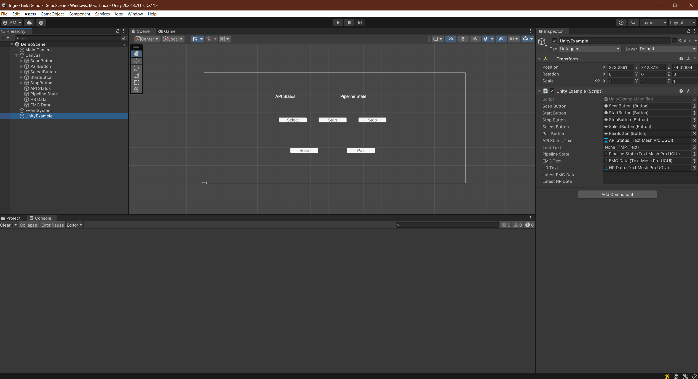
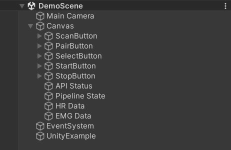
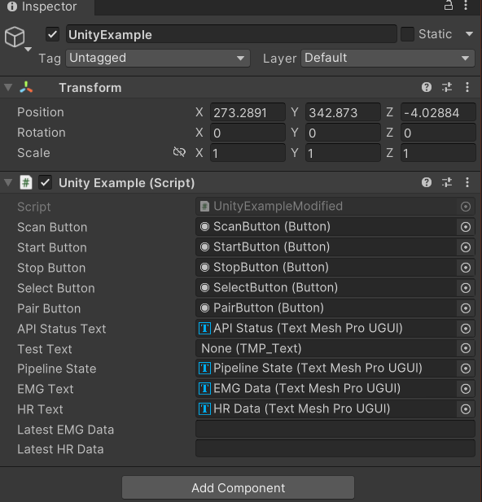

.. _analysis_to_collect:

============================================
Data Collection with Physiological Sensors
============================================
Now that you have explored both Unity and the various types of physiological sensors, it's time to begin integrating them together. You will do this using the **Delsys Trigno Link**, a device that allows multiple physiological sensors to be connected to a single computer via bluetooth. This tutorial will include an in-depth tutorial on how to connect and setup the Trigno Link, and how to collect data from the sensors attached to it. You will start simple, and develop a simple, console-based based Unity application that prints out the data recieved rom the sensors. The main goal of this module is to ensure that you can effectively use and read from the Trigno Link, and access that data in Unity. Once you have these basics down, the next module wll move on to more complex integration techniques using VR.

------------------------------
Setting up the Trigno Link
------------------------------

.. image:: ../../images/TrignoLinkPromo.png
  :width: 800
  :alt: An Image of the Trigno Link.

The Trigno Link is the key to integrating physiological sensors with Unity. While the Trigno Link is not required to receive data from only Trigno sensors, it is necessary to use *both* Trigno and third-party sensors congruently. As such, it is important to understand how the Link works in order to seamlessly integrate both Delsys and third-party sensors simultaneously. 

^^^^^^^^^^^^^^^^^^^^^
Trigno Link Design
^^^^^^^^^^^^^^^^^^^^^

The first step to effectively using the Trigno Link is knowing how it works. The Trigno Link is a wireless device that connects to a computer via a USB-C dongle. Two to thirty-two sensors can be simultaneously linked to the Trigno Link. Essentially, these sensors concurrently transmit their raw data to the Link, where it keeps their data streams separate and sends them to the computer for use. This data can come from a variety of sensors, including but not limited to any of the sensors mentioned in the previous module. Crucially, this device is not locked to only Delsys products, but supports many third-party options, vastly increasing its versatility. You will need the **Trigno Wireless BioFeedback System** in order for the Link to provide the synchronized data. You will connect the device to a computer using the USB-A side of the included cable, and attach the USB-C side to the female plug on the Link. An LED light will glow on the top of the Link once it has been connected. The color of this light can help determine the current feedback state of the Link. You can find a list of the different feedback states and their corresponding light colors in the `Trigno Link User Guide <https://delsys.com/downloads/USERSGUIDE/trigno/link-communication-module.pdf>`_.

^^^^^^^^^^^^^^^^^^^
Getting Started
^^^^^^^^^^^^^^^^^^^
Upon unboxing your Trigno Link, you'll be greeted to the compact device, a USB-C dongle, a quickstart guide, and a user guide. It is *highly* recommended to read the quickstart guide and user guide in conjunction with the tutorial presented here, as this will give you the most comprehensive understanding possible. Additionally, you can use these resources to troubleshoot any issues you have with the product. 

.. note::
    In order to use the Trigno Link, you must have at least two compatible physiological sensors, with at least one being a Trigno Sensor (Which you will already be using due to the requirement of the Trigno Wireless BioFeedback System's usage). The link itself does not generate any data, instead it allows data from *other* sensors to be read in tandem. All Delsys made sensors are natively supported, alongside a list of third-party sensors that you can find `here <https://delsys.com/trigno-link/>`_ in the *Applications* section.

To begin using the Link, you will need the *Trigno* Discover application, a piece of Delsys software used to monitor and receive data from the sensors on a computer. This software can be found `here <https://delsys.com/activation/>`_. As of writing this tutorial, the current version of this software is 1.6.5.. You will have to either log-in or sign up in order to use the application, and you have the option of working offline as well. Once you have the software installed and have created an account, you are ready to begin connecting sensors.

^^^^^^^^^^^^^^^^^^^^^
Connecting Sensors
^^^^^^^^^^^^^^^^^^^^^
Using the Trigno Link, Trigno Wireless BioFeedback System, and Trigno Discover, you can now connect sensors. To do this, follow the steps below:

.. image:: ../../images/trignoLink.jpg
  :width: 200
  :alt: An Image of the Trigno Link connected to a laptop. The light on the Link is glowing amber.

1. Connect the Trigno Link to your computer. First, plug the USB-A side of the included cable into the computer, then plug the USB-C side of the cable into the link itself. If done correctly, the LED indicator should glow amber on the Link. You are ready to move on to the next step.

2. Connect your Trigno Wireless BioFeedback System to your computer via USB. This is necessary to use the Trigno sensors and any other third-party sensors with the Link. You can find a manual to assist you in connecting this device and its sensors `here <https://www.delsys.com/downloads/USERSGUIDE/trigno/wireless-biofeedback-system.pdf>`_. Note that it is your responsibility to understand how to connect and use the various sensors you intend to employ. Usually, you can find detailed guides on the manufacturer's website. 

.. image:: ../../images/DiscoverHome.png
  :width: 800
  :alt: An Image of the homepage for Trigno Discover.

3. Launch the Trigno Discover application on your computer. Log in to your account and verify that the Trigno Link and Trigno Wireless BioFeedback System are recognized by the software (You shouldn't even be able to access the application if the Wireless Feedback System isn't connected). You should see a tab for the Trigno Base and for the Trigno Link in the app. Should you need additional assistance in using Trigno Discover, the `User Guide <https://delsys.com/downloads/USERSGUIDE/trigno/discover.pdf>`_ can help you.

.. image:: ../../images/DiscoverHomeConnected.png
  :width: 800
  :alt: An Image of the homepage for Trigno Discover with one Avanti sensor added.

#. Add the sensors you wish to use to the Sensor Configuration Panel on the home screen. You can do this manually using the *Add New Sensor* option. Once a scanner has been paired by the system, you can use the *Scan for Sensors* option to attempt to connect all previously connected sensors, making the manual pairing unnecessary for subsequent usage. Scanning for sensors can even find find some sensors without having added them before.Generally, the bast practice is to *Scan for Sensors* first and then use *Add New Sensor* to add any that weren't caught by the scan. For sensors connected via the Trigno Link, use the *Scan for Sensors* option in the Trigno Link tab while pairing on the sensor. 

.. image:: ../../images/DiscoverHR.png
  :width: 800
  :alt: An Image of the Trigno Link page for Trigno Discover with one HR sensor added.

#. Depending on the sensors you are using, you may have some additional options to pick between in the sensor's configuration mode selection. For example, Trigno Avanti sensors can switch between EMG, Accelerator, Gyroscope, Orientation, and IMU sensing. Refer to the manufacturers guide for your specific sensor to see what options are available. 

#. Once your sensors have all been connected and are visible on the *Sensor Configuration Panel*, it is good practice to run a test trial to make sure the data is being properly collected from all sensors. You can use the Trial Information Tab to control your data collection. 

.. note::
  While the Trigno Discover application can be used by itself to collect sensors from data and store it as csv data, the data collection used in this tutorial will be done using a Unity integration instead, using the data in real time to influence the Unity application. Despite this, Trigno Discover is an excellent tool for general data collection, and it is good have proficiency in it.
-------------------------------
Connecting to Unity
-------------------------------

.. warning::
  There is a known bug preventing the usage of the Delsys API with specific versions of Unity. While it is unknown exactly which versions are affected, 2022.3.7f1 has been tested and is working, so that is what will be used here and what is recommended for you to use as well. 

Now that you have your sensors connected and are ready to begin using them, it's time to create a Unity application. Follow the steps below to get set up for Unity development with the Delsys API. 

.. image:: ../../images/UnityLogin.png
  :width: 800
  :alt: An Image of the Unity login screen.

1. Launch Unity Hub and login to your Unity account. If you do not have either of these completed, see :ref:`new_to_install`.

.. image:: ../../images/EmptyProjects.png
  :width: 800
  :alt: An Image of the projects tab in Unity Hub.

2. On the sidebar on the left side of the application, select the *Projects* tab.

3. On the top right of the application, press the button titled *New project*.

.. image:: ../../images/create_link_project.png
  :width: 800
  :alt: An Image of the 2D project template in Unity Hub.

4. From here you can select any template project type you would like, depending on the context of the application you are creating. For this basic introduction to the integration, we will use the *2D Core* template. 

5. Likewise to the projects you created previously in this set of tutorials, you can name the project whatever you like and choose where it is saved.

6. Click the *Create project* button in the bottom right corner of the application to create the project and launch the Unity editor.

.. image:: ../../images/project_settings.png
  :width: 800
  :alt: An Image of navigating to the package manager in the new 3D project.

7. In the editor, navigate to the *Edit* option in the top ribbon, and select *Project Settings* from the dropdown menu.

.. image:: ../../images/il2cpp_net.png
  :width: 800
  :alt: An Image of the configuration section of the Player Settings menu.

8. In the project settings menu, select the option on the right toolbar titled *Player*. In the menu for your selected platform (in this case Windows, Mac, and Linux), scroll down to the *Configuration* section. In this location, make sure the *Scripting Backend* is set to IL2CPP and that the *Api Compatibility Level* is set to .NET Framework. Your project may take a minute to apply these changes. 

.. image:: ../../images/plugins_folder.png
  :width: 800
  :alt: An Image of the plugins folder in the assets folder.

9. In the assets folder of your Unity project, add an empty folder called *Plugins*. This is where you will put the API files.

.. image:: ../../images/delsys_github_repo.png
  :width: 800
  :alt: An Image of the Delsys Example Applications Github Repository.

10. To get the API files you will need to add to your project, go to the `Delsys Example Applications <https://github.com/delsys-inc/Example-Applications>`_ Github page. Select the green button labeled *Code*, and select the *Download ZIP* option from the dropdown menu that appears. This should download a ZIP file containing the example projects, as well as the API files you'll need.

11. Right click the ZIP file you just downloaded in your file explorer, and Extract it. In Windows 11, this is done through an option called *Extract All...* in the right click menu.

.. image:: ../../images/assets_subfolder.png
  :width: 800
  :alt: An Image of Assets subfolder in the Unity Example.

12. Open the extracted folder, and navigate to the ``~\Example-Applications-main\Unity\Assets`` subdirectory. 

13. Copy the Streaming Assets folder into your project's assets folder.

14. Navigate to the ``~\Example-Applications-main\Delsys Unity Example\Assets\Plugins`` folder and copy everything contained in it to the Plugins folder you created for your project. 

.. image:: ../../images/codedom.png
  :width: 800
  :alt: An Image of the Plugins folder of your project with System.Reactive.Linq.dll and System.Reactive.Linq.dll.meta, and System.Management.dll, and System.Management.dll.meta removed, and System.CodeDom.dll and System.CodeDom.dll.meta selected.

15. In the plugins folder in your project, delete the file called *System.CodeDom.dll* and its associated meta file *System.CodeDom.dll.meta*. Delete *System.Reactive.Linq.dll* and its associated meta file *System.Reactive.Linq.dll.meta*.  Delete *System.Management.dll* and its associated meta file *System.Management.dll.meta*.

.. image:: ../../images/project_root.png
  :width: 800
  :alt: An Image of the project's root folder with the moved file in it.

16. In the plugins folder in your project, Move the file called *SiUSBXp.dll* and its associated meta file *SiUSBXp.dll.meta* to the root folder of your project. This should result in something looking like the image above.

.. image:: ../../images/assets_unity_example.png
  :width: 800
  :alt: An Image of Assets subfolder with the UnityScript.cs in it.

17. Lastly, copy the *UnityExample.cs* script from the Delsys Unity Example project into the Assets folder of your project. You will be adding to this script to implement the Trigno Link, since it is easier than starting from scratch.

18. Allow your Unity project time to reload its domain, and then ensure there are no compilation errors with the project (You may see warnings, indicated with a yellow exclamation mark, these are okay). If there are none, you are ready to move on. If not, retry the steps above on a different version of Unity or try and troubleshoot the compilation error using the :ref:`troubleshooting` page of this site.

-------------------------------
A Simple Unity Application
-------------------------------

For this simple application, you are going to be slightly modifying the Unity Example script that you got from the Delsys Unity Example Application. It is entirely possible to make your own script utilizing the Delsys API, and if you wish to do so you may, but using the Example script as a template offers useful and working functions right from the start, saving you time and providing you with something you know works. If you do decide to create your own scripts utilizing the Delsys API in the future, you can use the Example script alongside the `Delsys API Quickstart Guide <http://data.delsys.com/DelsysServicePortal/api/web-downloads/MAN-032-1-1%20API%20Quick%20Start%20Guide.pdf>`_ and `Delsys API User Guide <https://delsys.com/downloads/USERSGUIDE/delsys-api.pdf>`_ to learn about the available functionality. You can find the Unity project on our `GitHub page <https://github.com/tarstutorials/vrsensorint-trignolinkdemo>`_.

^^^^^^^^^^^^^^^^^^^^^^^^^^^^^
Modifying the Example Script
^^^^^^^^^^^^^^^^^^^^^^^^^^^^^

.. Note::
  Before you begin modifying your script, please remember to put your API license and key into the ``private string key = "";`` and ``private string license = "";`` variables of your modified Example script. You cannot use the API without them.

Below is the modified code for the Example script that allows it to search for Trigno Link components alongside the Trigno RF ones. Beneath that you will be given descriptions of what each modification does, so you can use it in your future projects. 

.. code-block:: cs
  :linenos:

    using DelsysAPI.Channels.Transform;
    using DelsysAPI.Configurations;
    using DelsysAPI.Configurations.DataSource;
    using DelsysAPI.Contracts;
    using DelsysAPI.DelsysDevices;
    using DelsysAPI.Events;
    using DelsysAPI.Pipelines;
    using DelsysAPI.Transforms;
    using DelsysAPI.Utils;
    using System;
    using System.Collections.Generic;
    using System.IO;
    using System.Linq;
    using System.Threading.Tasks;
    using UnityEngine;
    using UnityEngine.UI;
    using UnityEngine.Events;
    using TMPro;
    using DelsysAPI.Components.TrignoLink;
    public class UnityExample : MonoBehaviour
    {
        //Paste key/license strings here
        private string key = "";
        private string license = "";

        /// 

        /// Data structure for recording every channel of data.
        /// 

        List<List<double>> Data = new List<List<double>>();
        public Button ScanButton;
        public Button StartButton;
        public Button StopButton;
        public Button SelectButton;
        public Button PairButton;
        IDelsysDevice DeviceSource = null;
        int TotalLostPackets = 0;
        int TotalDataPoints = 0;
        public TMP_Text APIStatusText, TestText, PipelineState, EMGText, HRText;
        Pipeline RFPipeline;
        ITransformManager TransformManager;
        string text, pipeline_state;
        UnityEvent m_scan;
        bool select, scan, start, stop, pair;
        string[] compoentNames;
        List<List<List<double>>> AllCollectionData = new List<List<List<double>>>();
        VerticalLayoutGroup verticalLayoutGroup;
        public string latestEMGData;
        public string latestHRData;

        private bool usingTrignoLink;
        public string latestEMGData;
        public string latestHRData;

        // Use this for initialization
        void Start()
        {

            Debug.Log("Entered Start Function.");

            usingTrignoLink = true;

            //Finding references to all the buttons in the scene
            ScanButton = GameObject.Find("ScanButton").GetComponent<Button>();
            ScanButton.onClick.AddListener((UnityEngine.Events.UnityAction) this.clk_Scan);
            
            StartButton = GameObject.Find("StartButton").GetComponent<Button>();
            StartButton.onClick.AddListener((UnityEngine.Events.UnityAction) this.clk_Start);

            StopButton = GameObject.Find("StopButton").GetComponent<Button>();
            StopButton.onClick.AddListener((UnityEngine.Events.UnityAction) this.clk_Stop);

            SelectButton = GameObject.Find("SelectButton").GetComponent<Button>();
            SelectButton.onClick.AddListener((UnityEngine.Events.UnityAction) this.clk_Select);

            PairButton = GameObject.Find("PairButton").GetComponent<Button>();
            PairButton.onClick.AddListener((UnityEngine.Events.UnityAction) this.clk_Pair);
            
            scan = true; //Enabling only the Scan button for now.
            start = false;
            stop = false;
            select = false;
            pair = false;

            CopyUSBDriver(); // Copying the SiUSBXp.dll file if not present
            InitializeDataSource(); //Initializing the Delsys API Data source
        }

        // Update is called once per frame
        void Update()
        {
            APIStatusText.text = text;
            SelectButton.enabled = select;
            ScanButton.enabled = scan;
            StartButton.enabled = start;
            StopButton.enabled = stop;
            PairButton.enabled = pair;
            PipelineState.text = PipelineController.Instance.PipelineIds[0].CurrentState.ToString();
            EMGText.text = "Latest EMG Data: " + latestEMGData;
            HRText.text = "Latest HR Data: " + latestHRData;
        }

        public void CopyUSBDriver()
        {
            string unityAssetPath = Application.streamingAssetsPath + "/SiUSBXp.dll";
            string adjacentToExePath = Application.dataPath + "/../SiUSBXp.dll";
            if (!File.Exists(adjacentToExePath))
            {
                File.Copy(unityAssetPath, adjacentToExePath);
            }
        }

        /// 

        /// Dumping all the debug statements from DelsysAPI into the Unity's Log file, see https://docs.unity3d.com/Manual/LogFiles.html for more details.
        /// 

        /// <returns> None </returns>
        public void TraceWriteline(string s, object[] args)
        {
            for(int i=0; i< args.Count();i++){
                s = s + "; " + args[i];
            }
            Debug.Log("Delsys API:- " + s);
            
        }
    
        #region Initialization
        public void InitializeDataSource()
        {
            
            text = "Creating device source . . . ";
            if(key.Equals("") || license.Equals("")){
                text = "Please add your license details from the code.";
            }
            var deviceSourceCreator = new DeviceSourcePortable(key, license);
            deviceSourceCreator.SetDebugOutputStream(TraceWriteline);
            DeviceSource = deviceSourceCreator.GetDataSource(new SourceType[2] { SourceType.TRIGNO_RF, SourceType.TRIGNO_LINK });
            text  = "Device source created.";
            DeviceSource.Key = key;
            DeviceSource.License = license;
            text = "Loading data source . . . ";

            try
            {
                LoadDataSource(DeviceSource);
            }
            catch(Exception exception)
            {
                text = "Something went wrong: " + exception.Message;
                return;
            }
            text = "Data source loaded and ready to Scan.";
        }

        public void LoadDataSource(IDelsysDevice ds)
        {
            PipelineController.Instance.AddPipeline(ds);

            RFPipeline = PipelineController.Instance.PipelineIds[0];
            TransformManager = PipelineController.Instance.PipelineIds[0].TransformManager;
            
            RFPipeline.TrignoRfManager.ComponentScanComplete += ComponentScanComplete;
            RFPipeline.CollectionStarted += CollectionStarted;
            RFPipeline.CollectionDataReady += CollectionDataReady;
            RFPipeline.CollectionComplete += CollectionComplete;
            RFPipeline.TrignoRfManager.ComponentAdded += ComponentAdded;
            RFPipeline.TrignoRfManager.ComponentLost += ComponentLost;
            RFPipeline.TrignoRfManager.ComponentRemoved += ComponentRemoved;        
        }

        #endregion

        #region Button Click events: clk_Scan, clk_Select, clk_Start, clk_Stop, clk_Pair
        public virtual async void clk_Scan()
        {
            Console.WriteLine("Scan Clicked");
            foreach(var comp in RFPipeline.TrignoRfManager.Components)
            {
                await RFPipeline.TrignoRfManager.DeselectComponentAsync(comp);
            }
            //Trying to search for Link components - will set link bool to false if fail
            try{
                foreach (var component in RFPipeline.TrignoLinkManager.Components)
                    await RFPipeline.TrignoLinkManager.DeselectComponentAsync(component);
                    Debug.Log("Trigno Link has sensors connected.");
            }
            catch(Exception e){
                Debug.Log("Trigno Link has no sensors connected.");
                usingTrignoLink = false;
            }
            text = "Scanning . . .";
            await RFPipeline.Scan();
        }

        public virtual void clk_Select()
        {
            SelectSensors();
        }

        public virtual async void clk_Start()
        {
            
            // The pipeline must be reconfigured before it can be started again.      
            bool success = ConfigurePipeline();
            if(success){
                Debug.Log("Starting data streaming....");
                text = "Starting data streaming....";
                await RFPipeline.Start(); 
                stop = true; 
            }
            else{
                Debug.Log("Configuration failed. Cannot start streaming!!");  
                text = "Fatal error!";
            }
        
        }

        public virtual async void clk_Stop()
        {
            await RFPipeline.StopInformationStream();
            await RFPipeline.Stop();
            RFPipeline.SetActiveDataSources(new List<SourceType>{SourceType.TRIGNO_RF, SourceType.TRIGNO_LINK});
            await RFPipeline.DisarmPipeline();
            PipelineController.Instance.RemovePipeline(0);

        }

        public virtual async void clk_Pair()
        {
            text = "Awaiting a sensor pair . . .";
            await RFPipeline.TrignoRfManager.AddTrignoComponent(new System.Threading.CancellationToken());
        }

        #endregion

        public void SelectSensors()
        {
            text = "Selecting all sensors . . .";

            // Select every component we found and didn't filter out.
            foreach (var component in RFPipeline.TrignoRfManager.Components)
            {
                bool success = RFPipeline.TrignoRfManager.SelectComponentAsync(component).Result;
                if(success){
                    text = component.FriendlyName + " selected!";
                }
                else{
                    text = "Could not select sensor!!";
                }
            }
            //Now doing search for link components if link is enabled.
            if(usingTrignoLink == true){
                foreach(var component in RFPipeline.TrignoLinkManager.Components){
                    bool success = RFPipeline.TrignoLinkManager.SelectComponentAsync(component).Result;
                    if (success == true){
                        text = component.FriendlyName + "selected!";
                    }else{
                        text = "Could not select sensor!!";
                    }
                }
            }    
            start = true;
        }

        /// 

        /// Configures the input and output of the pipeline.
        /// 

        /// <returns></returns>
        private bool ConfigurePipeline()
        {
            var inputConfiguration = new TrignoDsConfig();

            if (PortableIoc.Instance.CanResolve<TrignoDsConfig>())
            {
                PortableIoc.Instance.Unregister<TrignoDsConfig>();
            }

            PortableIoc.Instance.Register(ioc => inputConfiguration);

            foreach (var somecomp in RFPipeline.TrignoRfManager.Components.Where(x => x.State == SelectionState.Allocated))
            {       
                somecomp.SelectSampleMode(somecomp.DefaultMode);      
            }

            try
            {
                Debug.Log("Applying Input configurations");
                bool success_1 = RFPipeline.ApplyInputConfigurations(inputConfiguration);
                if(success_1){
                    text =  "Applied input configuration";
                    Debug.Log("Applied input configuration");
                }
                else{
                    text = "Input configurations failed";
                    Debug.Log("Input configurations failed");
                }
            }
            catch (Exception exception)
            {
                text = exception.Message;
            }
            RFPipeline.RunTime = int.MaxValue;

            TransformConnector transformConnector = new TransformConnector(RFPipeline);
            OutputConfig outputConfig = transformConnector.SetupTransforms();

            bool success_2 = RFPipeline.ApplyOutputConfigurations(outputConfig);
            if(success_2){
                text = "Applied Output configurations";
                Debug.Log("Applied Output configurations");
                return true;
            }
            else{
                text = "Output configurations failed!";
                Debug.Log("Output configurations failed!");
                return false;
            }        
        }
        

        #region Collection Callbacks -- Data Ready, Colleciton Started, and Collection Complete
        public virtual void CollectionDataReady(object sender, ComponentDataReadyEventArgs e)
        {
            //Channel based list of data for this frame interval
            List<List<double>> data = new List<List<double>>();

            for (int k = 0; k < e.Data.Count(); k++)
            {
                // Loops through each connected sensor
                for (int i = 0; i < e.Data[k].SensorData.Count(); i++)
                {
                    // Loops through each channel for a sensor
                    for (int j = 0; j < e.Data[k].SensorData[i].ChannelData.Count(); j++)
                    {
                        data.Add(e.Data[k].SensorData[i].ChannelData[j].Data);
                        for (int k2 = 0; k2 <e.Data[k].SensorData[i].ChannelData[j].Data.Count(); k2++){
                            if (i == 1)//Heart Rate Sensor Index
                            {
                                latestHRData = e.Data[k].SensorData[i].ChannelData[j].Data[k2].ToString();
                            }
                            else if (i == 0)//Avanti Sensor Index
                            {
                                latestEMGData = e.Data[k].SensorData[i].ChannelData[j].Data[k2].ToString();
                            }
                            Debug.Log(e.Data[k].SensorData[i].ChannelData[j].Data[k2]);
                        }
                    }
                }

            }

            //Add frame data to entire collection data buffer
            AllCollectionData.Add(data);
            text = AllCollectionData.Count.ToString();
        }

        public virtual void CollectionStarted(object sender, DelsysAPI.Events.CollectionStartedEvent e)
        {
            AllCollectionData = new List<List<List<double>>>();
            text = "CollectionStarted event triggered!";
            var comps = PipelineController.Instance.PipelineIds[0].TrignoRfManager.Components;
            
            // Refresh the counters for display.
            TotalDataPoints = 0;
            TotalLostPackets = 0;

            // Recreate the list of data channels for recording
            int totalChannels = 0;
            for (int i = 0; i < comps.Count; i++)
            {
                for (int j = 0; j < comps[i].TrignoChannels.Count; j++)
                {
                    if (Data.Count <= totalChannels)
                    {
                        Data.Add(new List<double>());
                    }
                    else
                    {
                        Data[totalChannels] = new List<double>();
                    }
                    totalChannels++;
                }
            }
        }

        public virtual async void CollectionComplete(object sender, DelsysAPI.Events.CollectionCompleteEvent e)
        {
            text = "CollectionComplete event triggered!";
            await RFPipeline.DisarmPipeline();
        }

        #endregion

        #region Component Events: Scan complete, Component Added, Lost, Removed
        public virtual void ComponentScanComplete(object sender, DelsysAPI.Events.ComponentScanCompletedEventArgs e)
        {
            text = "Scan Complete";

            select = true;
            pair = true;

        }

        public async void ComponentAdded(object sender, ComponentAddedEventArgs e)
        {

        }

        public virtual void ComponentLost(object sender, ComponentLostEventArgs e)
        {
            int sensorStickerNumber = RFPipeline.TrignoRfManager.Components.Where(sensor => sensor.Id == e.Component.Id).First().PairNumber;
            Console.WriteLine("It appears sensor " + sensorStickerNumber + " has lost connection. Please power cycle this sensor.");
            text = "It appears sensor " + sensorStickerNumber + " has lost connection";

        }

        public virtual void ComponentRemoved(object sender, ComponentRemovedEventArgs e)
        {

        }

        #endregion

    }

The first change made to the code from the original example script was the addition of the  lines ``using TMPro;`` and ``using DelsysAPI.Components.TrignoLink``. These lines add necessary functionality for Unity's updated text system and the Trigno Link, respectively.

After adding TMPro, change the line ``public Text APIStatusText, TestText, PipelineState;`` to ``public TMP_Text APIStatusText, TestText, PipelineState;``. This will convert the text variables used to the updated text system.

On the same line as the previous modification, add ``EMGDataText`` and ``HRDataText``. The result should look as follows: ``public TMP_Text APIStatusText, TestText, PipelineState, EMGDataText, HRDataText;``. These two variables will be used to display the latest EMG and HR data on screen.

The next modification that was made was the creation of the boolean variable ``usingTrignoLink``. This variable lets the script know whether or not a Trigno Link is being used. In the start method, its default value is set to true. Later, you will see that the scan function can change this value.  

Also in the start method, the lines: 

.. code-block:: cs
  

  ScanButton = GameObject.FindGameObjectWithTag ("ScanButton").GetComponent<Button>();
  ScanButton.onClick.AddListener((UnityEngine.Events.UnityAction) this.clk_Scan);
  
  StartButton = GameObject.FindGameObjectWithTag ("StartButton").GetComponent<Button>();
  StartButton.onClick.AddListener((UnityEngine.Events.UnityAction) this.clk_Start);

  StopButton = GameObject.FindGameObjectWithTag ("StopButton").GetComponent<Button>();
  StopButton.onClick.AddListener((UnityEngine.Events.UnityAction) this.clk_Stop);

  SelectButton = GameObject.FindGameObjectWithTag ("SelectButton").GetComponent<Button>();
  SelectButton.onClick.AddListener((UnityEngine.Events.UnityAction) this.clk_Select);

  PairButton = GameObject.FindGameObjectWithTag ("PairButton").GetComponent<Button>();
  PairButton.onClick.AddListener((UnityEngine.Events.UnityAction) this.clk_Pair);

are changed to:

.. code-block:: cs

  
  ScanButton = GameObject.Find("ScanButton").GetComponent<Button>();
  ScanButton.onClick.AddListener((UnityEngine.Events.UnityAction) this.clk_Scan);
  
  StartButton = GameObject.Find("StartButton").GetComponent<Button>();
  StartButton.onClick.AddListener((UnityEngine.Events.UnityAction) this.clk_Start);

  StopButton = GameObject.Find("StopButton").GetComponent<Button>();
  StopButton.onClick.AddListener((UnityEngine.Events.UnityAction) this.clk_Stop);

  SelectButton = GameObject.Find("SelectButton").GetComponent<Button>();
  SelectButton.onClick.AddListener((UnityEngine.Events.UnityAction) this.clk_Select);

  PairButton = GameObject.Find("PairButton").GetComponent<Button>();
  PairButton.onClick.AddListener((UnityEngine.Events.UnityAction) this.clk_Pair);

This is because the Unity tag system used in the ``FindGameObjectWithTag`` method is outdated and no longer functions. Simply changing each instance of this function to the newer ``Find`` method will fix this.

.. Note::
  You must name the ``GameObject`` s the same name as given to the Find method. For example, the button you want to use as a "Stop" button must be named "StopButton" for it to be found by ``Find``. You can change the argument of ``Find`` to whatever you like, but just know that the corresponding ``GameObject`` must share that name, and it is case-sensitive.

Next, in the ``Update`` method, add the lines ``EMGText.text = "Latest EMG Data: " + latestEMGData;`` and ``HRData.text = "Latest HR Data: " + latestHRData;``. Doing this makes sure that Unity updates the on-screen text displaying the latest data every frame.

Now getting into more substantial changes, in the function ``InitializeDataSource``, the line ``DeviceSource = deviceSourceCreator.GetDataSource(SourceType.TRIGNO_RF);`` must be changed to ``DeviceSource = deviceSourceCreator.GetDataSource(new SourceType[2] { SourceType.TRIGNO_RF, SourceType.TRIGNO_LINK });`` . This is what tells the API to search for Trigno Link components alongside the regular RF ones.

Another important change to make is to the ``clk_Scan`` method. Here, add a new try-catch block right after the foreach loop but before the assigning variable ``text`` to "scanning" and awaiting the scan. The try-catch should be composed of the following:

.. code-block:: cs

  
  try{
    foreach (var component in RFPipeline.TrignoLinkManager.Components)
        await RFPipeline.TrignoLinkManager.DeselectComponentAsync(component);
        Debug.Log("Trigno Link has sensors connected.");
  }
    catch(Exception e){
    Debug.Log("Trigno Link has no sensors connected.");
    usingTrignoLink = false;
  }

This block of code tries to check for Trigno Link components connected to the system. If it finds them, it adds them to the list of components. If none are found, the system sets the boolean ``usingTrignoLink`` to false, and the Trigno Link is not considered connected.

Next, in the ``clk_stop`` method, add the following four lines of code:

.. code-block:: cs

  
  await RFPipeline.StopInformationStream();
  RFPipeline.SetActiveDataSources(new List<SourceType>{SourceType.TRIGNO_RF, SourceType.TRIGNO_LINK});
  await RFPipeline.DisarmPipeline();
  PipelineController.Instance.RemovePipeline(0);

The purpose of these lines is to ensure a smooth disconnection of the devices connected to the API, now including the Trigno Link.

An important modification to make is to the ``SelectSensors`` method. Here, you are going to want to add an additional foreach loop that only runs if the Trigno Link is being used (as determined by the  value of ``usingTrignoLink``). This loop will search through the Trigno Link's connected sensors and select each of them for data collection. The code should be written as follows, and should be placed right below the outermost closing bracket of the first loop, before ``start`` is set to true:

.. code-block:: cs

  
  if(usingTrignoLink == true){
      foreach(var component in RFPipeline.TrignoLinkManager.Components){
          bool success = RFPipeline.TrignoLinkManager.SelectComponentAsync(component).Result;
          if (success == true){
              text = component.FriendlyName + "selected!";
          }else{
              text = "Could not select sensor!!";
          }
      }
  }

Lastly, In the ``CollectionDataReady`` method, add the following code snippet to the innermost for loop:

.. code-block:: cs

    if (i == 1)//Heart Rate Sensor Index
                        {
                            latestHRData = e.Data[k].SensorData[i].ChannelData[j].Data[k2].ToString();
                        }
                        else if (i == 0)//Avanti Sensor Index
                        {
                            latestEMGData = e.Data[k].SensorData[i].ChannelData[j].Data[k2].ToString();
                        }

The result should be:

.. code-block:: cs

    public virtual void CollectionDataReady(object sender, ComponentDataReadyEventArgs e)
    {
        //Channel based list of data for this frame interval
        List<List<double>> data = new List<List<double>>();

        for (int k = 0; k < e.Data.Count(); k++)
        {
            // Loops through each connected sensor
            for (int i = 0; i < e.Data[k].SensorData.Count(); i++)
            {
                // Loops through each channel for a sensor
                for (int j = 0; j < e.Data[k].SensorData[i].ChannelData.Count(); j++)
                {
                    data.Add(e.Data[k].SensorData[i].ChannelData[j].Data);
                    for (int k2 = 0; k2 <e.Data[k].SensorData[i].ChannelData[j].Data.Count(); k2++){
                        if (i == 1)//Heart Rate Sensor Index
                        {
                            latestHRData = e.Data[k].SensorData[i].ChannelData[j].Data[k2].ToString();
                        }
                        else if (i == 0)//Avanti Sensor Index
                        {
                            latestEMGData = e.Data[k].SensorData[i].ChannelData[j].Data[k2].ToString();
                        }
                        Debug.Log(e.Data[k].SensorData[i].ChannelData[j].Data[k2]);
                    }
                }
            }

        }

        //Add frame data to entire collection data buffer
        AllCollectionData.Add(data);
        text = AllCollectionData.Count.ToString();
    }

The purpose in doing this is to update the latest heart rate data and the latest EMG data each time a new data packet is recieved.  This ensures that the data displayed is the newest available.

Now that all of the modifications have been made, save your script using *ctrl + S* on Windows, or *cmd + S* on Mac, and ensure that Unity does not display any compiler errors. If you encounter errors, you can always copy and paste the entire script from this page and overwrite yours, since the script here is known to work. You are now ready to move on to adding the necessary ``GameObject`` s to the project.

^^^^^^^^^^^^^^^^^^^^^^^^^^^^^^^^
Adding GameObjects
^^^^^^^^^^^^^^^^^^^^^^^^^^^^^^^^

If you are building from the example script, you are going to need a few ``GameObject`` s in order to create the scene for your application. Please create the following:

* A Canvas Object: This will be the parent object for your buttons and text, and defines what the screen shows. This is added through the UI section of the object creation dropdown, and creates an Event System with it.

* An Event System Object: This is used to make your UI elements interactable. Again, this should be created alongside your canvas.

* A Main Camera: This is included with the sample scene, and it just defines the view of the game. It should be created for you already.

* A Unity Example Object: This is the first object you must add yourself, and it is the **most** important object for the integration. It should be an Empty object, and should have the modified Example Script attached as a component. 

.. note::
    TMP Buttons are set up slightly differently than the ones you used in earlier modules. For these, the text for the button is contained in a child Text(TMP) object. TO change the text displayed on the button, got to this child object and change the text input component.

* A Scan Button: This will be used to scan for sensors connected to the base station and the Trigno Link. Ensure that the name for this ``GameObject`` matches the one given as argument in the ``Find`` function for the ``GameObject`` ScanButton in the Example Script. If you have not changed the arguments, the name should be "ScanButton".

* A Start Button: This will be used to start collecting data once all of the sensors have been connected. Ensure that the name for this ``GameObject`` matches the one given as argument in the ``Find`` function for the ``GameObject`` StartButton in the Example Script. If you have not changed the arguments, the name should be "StartButton".

* A Pair Button: This will be used to pair sensors to the base station that were not previously paired in Trigno Discover. A sensor *must* be paired to the system before it can be picked up by a scan. Ensure that the name for this ``GameObject`` matches the one given as argument in the ``Find`` function for the ``GameObject`` PairButton in the Example Script. If you have not changed the arguments, the name should be "PairButton".

* A Stop Button: This will be used to disarm the Delsys API pipeline and safely stop data collection once clicked.  Ensure that the name for this ``GameObject`` matches the one given as argument in the ``Find`` function for the ``GameObject`` StopButton in the Example Script. If you have not changed the arguments, the name should be "StopButton".

* A Select Button: This wil be used after the scan button to select every sensor found by the scan, and must be used before clicking the start button. Ensure that the name for this ``GameObject`` matches the one given as argument in the ``Find`` function for the ``GameObject`` SelectButton in the Example Script. If you have not changed the arguments, the name should be "SelectButton".

These five buttons provide the core functionality for the API, but there are two additional ``GameObject`` s you should add that can provide additional information about the API's status. These should both be Text Mesh Pro Text objects. They are as follows:

* An API Status Text: This will display the current status of the API in real-time, so you an get a better idea of what state it's in while your application is running. You will need to select the Unity Example object, and in the script component section of the inspector, drag and drop the API status into the "API Status Text" slot. You will do the same for the following objects as well.

* A Pipeline State Text: This will display the current state of the pipeline, and whether or not the base station is properly connected. As with the previous object, assign this object to its respective slot in the script component of the Unity Example object.

* An HR Data Text: This will display the latest HR data received from the sensor.

* An EMG Data Text: This will display the latest EMG data received from the sensor.

At the end of the object creation, your object hierarchy should look like the following: 

ir Button, Start Button, Stop Button, Select Button,  API Status Text, Pipeline State Text, HR Data Text, and EMG Data Text are all children of the Canvas.

And, your Unity Example Script Object's script component should have the following filled in for it's public variable slots. You can drag and drop any of the objects that are missing or incorrectly placed in the slots from the object hierarchy into the slots:

 Button assigned to ``PairButton`` , the API Status Text assigned to ``API Status`` , and the Pipeline State assigned to ``PipelineState`` .

Make sure to move all of the text and button objectws so that they are not overlapping each other. You have now created all the necessary ``GameObject`` s for this project, and are ready to run it and begin running your project.

^^^^^^^^^^^^^^^^^^^^^^^^^^^^^^
Running the Application
^^^^^^^^^^^^^^^^^^^^^^^^^^^^^^

.. youtube:: kMafpMTUzn0

**[Click on the above video for our YouTube tutorial on Trigno Link Data Collection.]**

Now that you have the application properly set up and know how the data is being read, you are ready to actually run the application you've created. Follow the steps below to do so:

1. Connect your Trigno Base Station to your computer via USB, and ensure it's power supply is connected to an outlet.

2. Connect your Trigno Link to your computer via USB. 

3. Press the Play Button in the top-center of the Unity editor and ensure that the API Status is displayed as "Data source loaded and ready to Scan." and the Pipeline State is displayed as "Off".

4. Pull out an Avanti sensor from the base station and press it against a magnet to put it in scanning mode. Remember you need at least one Avanti sensor active to use the Link.

5. Turn on your Trigno Link compatible sensor and put it in scanning mode.

6. In Unity, select the Scan Button and wait for the system to pick up the powered on sensors. (You can check the Unity Console to see if they were found.)

7. After scanning is complete, press the Select Button. Make sure that all the sensors were selected. (again, you can use the Unity Console to check this.)

8. Click the Start Button. If you check the Console, you should see all of the data being printed out from the sensors in real-time. Note that sensors may have different sampling rates, so data may come at different times. If you have accessed the data anywhere else, you should be seeing its effects now.

9. When you are done collecting data, click the Stop Button. While the application is still running, you can access all of the data from the ``AllCollectionData`` variable.

10. Return the sensors to the base station or power them off. You have successfully collected data using the Trigno Link and Unity!

---------------------------------------
Additional Information
---------------------------------------

^^^^^^^^^^^^^^^^^^^^^^^^^^^^^^^^^^^^^^^^
Collecting Sensor Data in Non-Real Time
^^^^^^^^^^^^^^^^^^^^^^^^^^^^^^^^^^^^^^^^

There are two ways to easily access the data collected from using the API. The first method is for non-real-time data collection. You will notice that there is a variable in the modified example script you made called ``List<List<List<double>>> AllCollectionData`` . This list is filled with the data collected during real-time collection. Once data is no longer collected, you can read from this list to access the collected data.  Notice that this list is a list of lists of lists of doubles. The outermost list contains the components connected to the system (the sensors), the first inner list contains the channels for each component, so if your sensor reads multiple types of data at once you can access all of it. The innermost list contains the actual data for the specific sensors specified channel. So for instance, if I only had one Avanti EMG connected and wanted to read the EMG data from it, I could access the data with ``AllCollectionData[0][0]`` . This would return the list of data contained within the first sensor, and in its first channel. If I were looking for a specific piece of data at, for example, time stamp 70, I could access that specific data with ``AllCollectionData[0][0][69]`` . Remember that C# starts indexing at zero, so your timestamp will be offset by one. You can access this data in a separate script by modifying the declaration of the variable in the Unity Example script. Unchanged, the declaration is ``List<List<List<double>>> AllCollectionData = new List<List<List<double>>>();`` . By simply adding ``public`` in front of the declaration, you can make the variable accessible to other scripts. This should look like ``public List<List<List<double>>> AllCollectionData = new List<List<List<double>>>();`` . To access this in another script, you can use the following code block as a template:

.. code-block:: cs

    //first create a GameObject the script whose data you're trying to access is attached to
    public GameObject ScriptHolder;
    //then define the script you are looking for (In our case, type_of_script would be UnityExample, but in other cases it will be the name of the script;s class)
    private type_of_script ExampleScript;
    //last, define where to store the data. Must be same type as the data. If you don't know what type it is, you can use "var" and C# will auto-assign its type;
    var data;

    //then, in start function get the script component from the GameObject
    private void Start()
    {
        ExampleScript = ScriptHolder.GetComponent<type_of_script>();
    }

    //to access the data use this line of code. In or case, data_to_access would be AllCollectionData. You can also change the data this way too, so be careful!
    data = ExampleScript.data_to_access;

^^^^^^^^^^^^^^^^^^^^^^^^^^^^^^^^^^^^
Collecting Sensor Data in Real Time
^^^^^^^^^^^^^^^^^^^^^^^^^^^^^^^^^^^^

To access the data in real-time, as it comes in from the sensor, you need to get the data at its source. The easiest way to do this is to modify the ``CollectionDataReady`` method in your Unity Example script. by default, the method should look like this:

.. code-block:: cs

    public virtual void CollectionDataReady(object sender, ComponentDataReadyEventArgs e)
      {
          //Channel based list of data for this frame interval
          List<List<double>> data = new List<List<double>>();

          for (int k = 0; k < e.Data.Count(); k++)
          {
              // Loops through each connected sensor
              for (int i = 0; i < e.Data[k].SensorData.Count(); i++)
              {
                  // Loops through each channel for a sensor
                  for (int j = 0; j < e.Data[k].SensorData[i].ChannelData.Count(); j++)
                  {
                      data.Add(e.Data[k].SensorData[i].ChannelData[j].Data);
                      for (int k2 = 0; k2 <e.Data[k].SensorData[i].ChannelData[j].Data.Count(); k2++){
                          Debug.Log(e.Data[k].SensorData[i].ChannelData[j].Data[k2]);
                      }
                  }
              }

          }

          //Add frame data to entire collection data buffer
          AllCollectionData.Add(data);
          text = AllCollectionData.Count.ToString();
      }

Basically, what is happening in this function is the data for the specific frame your application is on is being read, and the three for-loops make sure that the data from each channel of every sensor is read. Notice the line ``Debug.Log(e.Data[k].SensorData[i].ChannelData[j].Data[k2]);`` in the innermost for-loop. This line prints out every single piece of data from every sensor for this frame to the Unity log. So, if you wish to access data from a specific sensor, you can add a line into the innermost for-loop to looking for that specific data. For example, you could add the line ``latestDataFromSensor1Channel1 = e.Data[k].SensorData[0].ChannelData[0].Data[k2];`` to the innermost for-loop, and collect new data every frame. And similarly to the above non-real time method, if you want to access this data outside of the Example Script, you can define ``data`` as ``latestDataFromSensor1Channel1`` and access it using the template. This will give you access to the data as it comes. If you have multiple sensors connected, make sure you are accessing the data from the correct sensor and channel. Alternatively, if you know the sensor's index, you can access it's data in real time using an if statement like this:

.. code-block:: cs

        //Channel based list of data for this frame interval
        List<List<double>> data = new List<List<double>>();

        for (int k = 0; k < e.Data.Count(); k++)
        {
            // Loops through each connected sensor
            for (int i = 0; i < e.Data[k].SensorData.Count(); i++)
            {
                // Loops through each channel for a sensor
                for (int j = 0; j < e.Data[k].SensorData[i].ChannelData.Count(); j++)
                {
                    data.Add(e.Data[k].SensorData[i].ChannelData[j].Data);
                    for (int k2 = 0; k2 <e.Data[k].SensorData[i].ChannelData[j].Data.Count(); k2++){
                        if (i == 1)//Heart Rate Sensor Index
                        {
                            latestHRData = e.Data[k].SensorData[i].ChannelData[j].Data[k2].ToString();
                        }
                        else if (i == 0)//Avanti Sensor Index
                        {
                            latestEMGData = e.Data[k].SensorData[i].ChannelData[j].Data[k2].ToString();
                        }
                        Debug.Log(e.Data[k].SensorData[i].ChannelData[j].Data[k2]);
                    }
                }
            }

        }

        //Add frame data to entire collection data buffer
        AllCollectionData.Add(data);
        text = AllCollectionData.Count.ToString();

You can find out more about the sensors and their channels from the `Delsys API User Guide <https://delsys.com/downloads/USERSGUIDE/delsys-api.pdf>`_.

-------------------------------
Section Review
-------------------------------

Now that you have collected data from the Trigno Link in a regular 2D Unity project, you are ready to extend that knowledge to VR! Luckily, not much changes in the implementation going from 2D to VR, so it should be a quick process for the next module, especially because you already learned the basics of VR in module two. Thank you so much for sticking around, your hard work is appreciated! 

^^^^^^^^^^^^^^^^^^^^^^^^^^^^
Module Self-Assessment
^^^^^^^^^^^^^^^^^^^^^^^^^^^^

.. quizdown::

   ---
   shuffle_answers: false
   ---

   ## True or False? You need to have at least one Avanti sensor connected to use the Trigno Link

   > Re-read the Getting Started section.

   1. [x] True
   2. [ ] False
        > The correct answer is True.

    ## True or False? The Unity Example ``GameObject`` is not necessary for the Trigno Link Integration.

    > Re-read the section on Adding GameObjects.

    1. [ ] True
        > The correct answer is False.
    2. [x] False

    ## Which of the following is not one of the lists in ``AllCollectionData`` ?

    > Re-read the section on Collecting Sensor Data in Non-Real Time.

    1. [ ] Component
        > The correct answer is Time Stamp.
    2. [x] Time Stamp
    3. [ ] Channel
        > The correct answer is Time Stamp.
    4. [ ] Data
        > The correct answer is Time Stamp.

    ## Where can you find logged information about the application while it's running?

    > Re-read the sections on Running the Application.

    1. [ ] The Trigno Base Station
        > The correct answer is The Unity Console.
    2. [ ] The Inspector Window
        > The correct answer is The Unity Console.
    3. [ ] The Trigno Link
        > The correct answer is The Unity Console.
    4. [x] The Unity Console