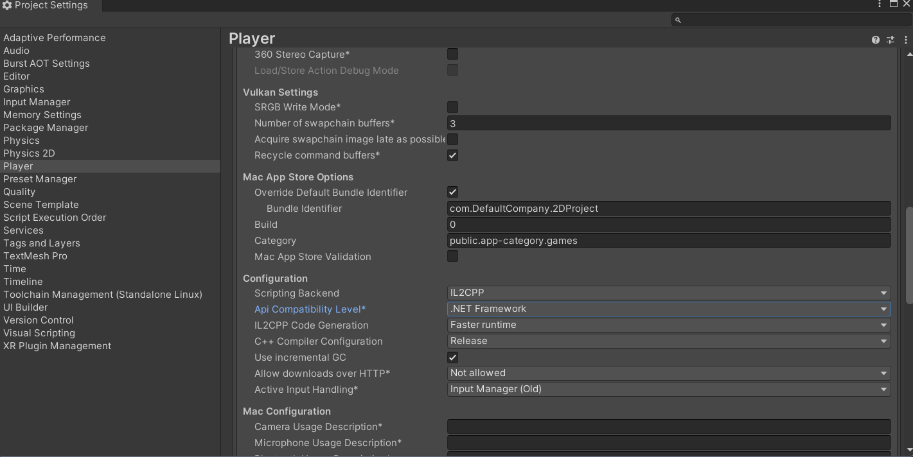
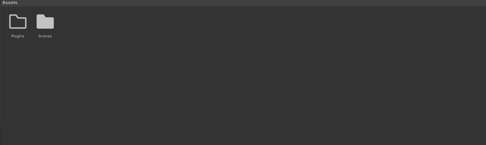

.. _sensors_to_int:

=====================
Integration with VR
=====================

Now that you have successfully managed to create a simple 2D application that integrates the Trigno Link and some physiological sensors, it is time to take what you know and apply it to a virtual reality project. The core principles used are exactly the same as with the 2D application, it is just a matter of modifying the approach to create a VR app instead.

------------------------------------------
Creating A New VR Project with Delsys API
------------------------------------------

In order to properly set up your VR project for physiological sensor integration, you will be combining the steps used in modules 2 and 4 to build your project. The combined instructions will be repeated below for your convenience:

.. image:: ../../images/UnityLogin.png
  :width: 800
  :alt: An image of the Unity login screen.

1. Launch Unity Hub and login to your Unity account. If you do not have either of these completed, see :ref:`new_to_install`.

.. image:: ../../images/EmptyProjects.png
  :width: 800
  :alt: An image of the projects tab in Unity Hub.

2. On the sidebar on the left side of the application, select the *Projects* tab.

3. On the top right of the application, press the button titled *New project*.

.. image:: ../../images/NewVRProject.png
  :width: 800
  :alt: An image of a 2D Mobile template for a project in Unity Hub.

4. Under the templates section, select the *VR Core* option. You may have to download the template if you have not used it already. The button to download it can be seen on the right side of the application after clicking on the template.

5. Choose a name for your project. It can be anything you like, but we recommend naming it with one word in order to make file access easier.

6. Choose the where you'd like to store your project. Be sure to pick a location that is easy to find.

7. Click the *Create project* button in the bottom right corner of the application. This will create the project and launch the editor, which will contain a pre-made sample scene for you to start with.

8. In the editor, navigate to the *Edit* option in the top ribbon, and select *Project Settings* from the dropdown menu.

9. In the project settings menu, select the option on the right toolbar titled *Player*. In the menu for your selected platform (in this case Windows, Mac, and Linux), scroll down to the *Configuration* section. In this location, make sure the *Scripting Backend* is set to IL2CPP and that the *Api Compatibility Level* is set to .NET Framework. Your project may take a minute to apply these changes. 

10. In the assets folder of your Unity project, add an empty folder called *Plugins*. This is where you will put the API files.

.. image:: ../../images/delsys_github_repo.png
  :width: 800
  :alt: An Image of the Delsys Example Applications Github Repository.

11. To get the API files you will need to add to your project, go to the `Delsys Example Applications <https://github.com/delsys-inc/Example-Applications>`_ Github page. Select the green button labeled *Code*, and select the *Download ZIP* option from the dropdown menu that appears. This should download a ZIP file containing the example projects, as well as the API files you'll need.

12. Right click the ZIP file you just downloaded in your file explorer, and Extract it. In Windows 11, this is done through an option called *Extract All...* in the right click menu.

.. image:: ../../images/assets_subfolder.png
  :width: 800
  :alt: An Image of Assets subfolder in the Unity Example.

13. Open the extracted folder, and navigate to the ``~\Example-Applications-main\Delsys Unity Example\Assets`` subdirectory. 

14. Copy every file that is in the Plugins folder of the assets folder and paste them into the empty Plugins folder you created in your project. 

.. image:: ../../images/codedom.png
  :width: 800
  :alt: An Image of the Plugins folder of your project with System.CodeDom.dll and System.CodeDom.dll.meta selected.

15. In the plugins folder in your project, delete the file called *System.CodeDom.dll* and its associated meta file *System.CodeDom.dll.meta*. 

.. image:: ../../images/project_root.png
  :width: 800
  :alt: An Image of the project's root folder with the moved file in it.

16. In the plugins folder in your project, Move the file called *SiUSBXp.dll* and its associated meta file *SiUSBXp.dll.meta* to the root folder of your project. This should result in something looking like the image above.

.. image:: ../../images/assets_unity_example.png
  :width: 800
  :alt: An Image of Assets subfolder with the UnityScript.cs in it.

17. Lastly, copy the modified *UnityExample.cs* script from the project you created in the previous module into the Assets folder of your project. This way, you do not have to reimplement Trigno Link functionality.

18. Allow your Unity project time to reload its domain, and then ensure there are no compilation errors with the project (You may see warnings, indicated with a yellow exclamation mark, these are okay). If there are none, you are ready to move on. If not, retry the steps above on a different version of Unity or try and troubleshoot the compilation error using the :ref:`troubleshooting` page of this site.

-----------------------------------------
Integrating Sensors with Our GameObjects
-----------------------------------------

---------------------------------
Testing and Refining Integration
---------------------------------

--------------------------------
Section Review
--------------------------------