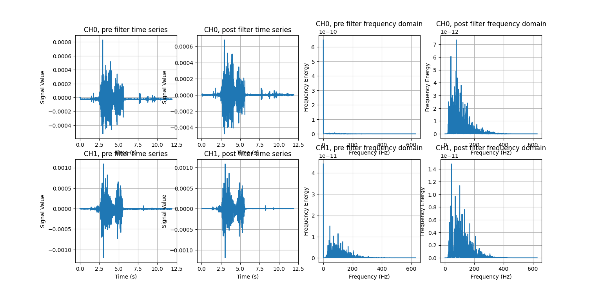
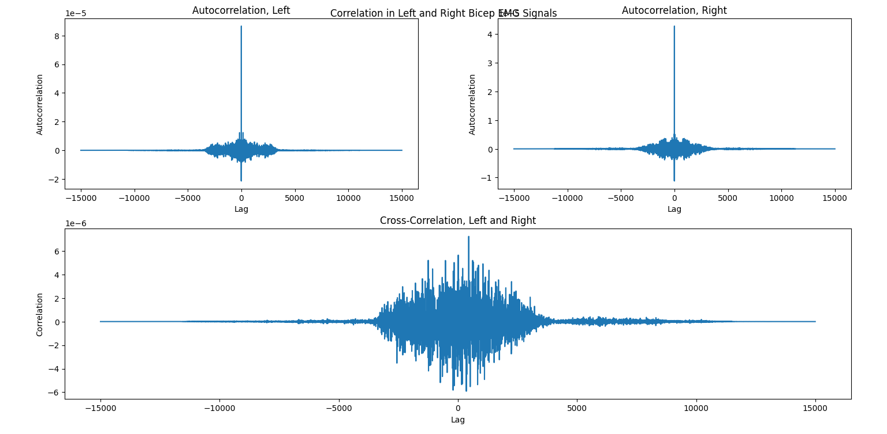
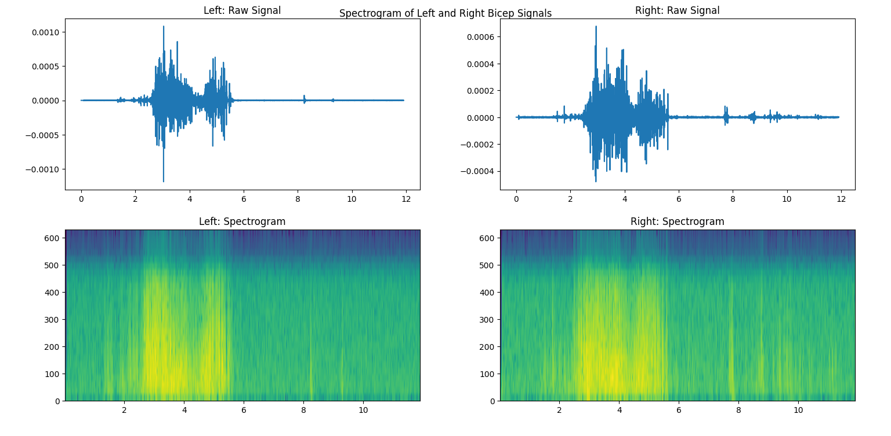
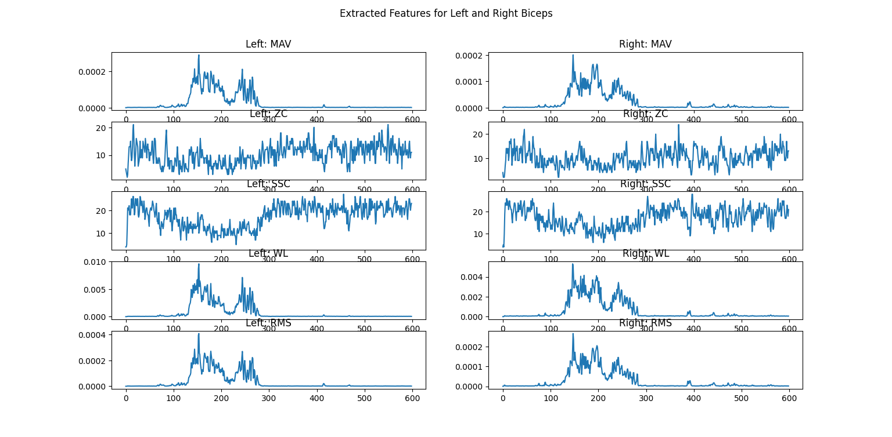
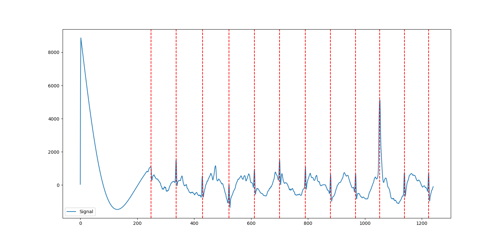

.. _sensors_to_analysis:
.. _collect_to_analysis:

===============
Data Analysis
===============

-----------------------------
Introduction to Data Analysis
-----------------------------

Being able to collect physiological data and use it in VR is wonderful, but isn't really meaningful for making any observations or conclusions without performing analysis. The last section of this tutorial will focus on basic tools to analyze the data that we've collected from the VR application.

Since we're collecting data from the user as they perform some tasks, with the sensors updating the results periodically, this is an example of **time-series** data. This is a unique type of data where the sequence of observations matters. Additionally, certain models may reflect the fact that observations closer together in time should be more closely related than those further apart. We'll go through some methods of extracting relevant information numerically and visually from the data provided by each sensor.

^^^^^^^^^^^^^^^^^^^^^^^^^
Programming Prerequisites
^^^^^^^^^^^^^^^^^^^^^^^^^

Throughout this section, we'll be using Python as the tool for the analysis. Python is one of the most popular languages for this, as it has a wide variety of open source resources available and a strong community of developers that can provide feedback to each other throughout the process. However, much of these concepts could be implemented similarly in other languages. This tutorial will assume a basic understanding of programming concepts and some Python syntax.

Python can be easily downloaded for free from their `website <https://www.python.org/downloads/>`_. You'll then need to install the following packages (documentation linked), using ``pip`` (the default installer) or your favorite package manager:

* General Data Analysis
   - `Matplotlib <https://matplotlib.org/>`_
   - `NumPy <https://numpy.org/>`_
   - `SciPy <https://scipy.org/>`_
* Working with Physiological Data 
   - `LibEMG <https://libemg.github.io/libemg/>`_ [#]_
   - `NeuroKit2 <https://neuropsychology.github.io/NeuroKit/introduction.html>`_ [#]_

.. note::
   `Pandas <https://pandas.pydata.org/>`_ is another common Python library for data analysis. However, for our purposes, NumPy will be simpler to use, and it's used natively by the other libraries we're using for physiological data.

The following terminal command will install all of the prevously mentioned packages using the ``pip`` package manager:
::

    pip install matplotlib numpy scipy libemg neurokit2

With Python ready to go, we are ready to begin analysis. Let's dive in starting with EMG.

------------
EMG Analysis
------------

To work through this part of the tutorial, we'll use a sample file where a person lifted a 15 pound box from the ground and then set it back down. Their left and right biceps were measured using sEMG sensors. The data can be downloaded :download:`here <sample_semg.csv>` if you'd like to follow along!

^^^^^^^^^^^^^^^^^^^^^^^
Raw Data: Load and Plot
^^^^^^^^^^^^^^^^^^^^^^^

The first step to the process of analyzing the data we've collected is, of course, loading it into memory. The data is in .csv format, which is a common text-based format for two-dimensional data. One simple way to load this data is to use ``numpy.loadtxt`` (documented `here <https://numpy.org/doc/stable/reference/generated/numpy.loadtxt.html>`_).

There are options to access the data with column names, but this becomes inconvenient to work with later when we're passing the data to other library functions. Since the columns of our data are relatively simple to remember, it's better to just load it as a regular ``ndarray`` (NumPy: *n*-dimensional array). We can format our variable names by *slicing*, which is a common way to subset data in NumPy. A ``:`` grabs all rows or columns. A list with ``[]`` is used to grab only certain rows or columns by index. Lastly, a range (e.g., ``1:3``) is used to grab rows or columns within a range of indices. We'll separate the data into the time column and the EMG columns. Finally, to check the dimensionality of the raw and sliced data, we can use NumPy's ``shape`` function, which returns the number of elements in each dimension (rows, then columns).

.. code-block:: python
   :linenos:

   import numpy as np

   TIME_CUTOFF = 15000

   df = np.loadtxt('sample_semg.csv', delimiter=',', dtype=float, max_rows=TIME_CUTOFF)
   emg_channels = df[:,[1,2]]
   time = df[:,0]
   print(df.shape, emg_channels.shape, time.shape)

Notice that we have 15,000 rows and 3 columns. Each row represents the signal values read from the sensor at a particular time, and the columns denote time (seconds), right bicep EMG (volts), and left bicep EMG (volts). Checking the shape is always a good step to ensure there wasn't an error in the data loading process.

Another step to check the data quality and give us an idea of what the data looks like is plotting. Let's use NumPy to calculate some basic summary statistics, such as the mean and standard deviation, and plot them on the data using ``matplotlib.pyplot``. Since we're plotting data from multiple EMG channels, it's a good idea to use ``pyplot.subplots``, which puts multiple plots in a grid into the figure. You can specify the grid layout with two parameters (rows and columns), but here we'll only need one since we just want to stack two plots on top of each other.

The ``pyplot.plot`` function is a universal plotting function: it takes ``x`` and ``y`` to be plotted, as well as some optional visual parameters like ``label``, ``color``, ``linewidth``, and more. We use ``pyplot.axhline`` to plot horizontal lines representing the mean plus and minus two standard deviations. Finally, we can set the subplot titles and axis titles, turn on the legend, and set the overall figure title.

.. code-block:: python
   :linenos:

   import matplotlib.pyplot as plt

   mean_raw = emg_channels.mean(axis=0) # 'axis=0' calculates mean of the columns
   std_raw = emg_channels.std(axis=0)
   fig1, ax1 = plt.subplots(2)

   ax1[0].plot(time, emg_channels[:,1], label = 'signal')
   ax1[0].axhline(y = mean_raw[1], color = 'red', label = 'mean')
   ax1[0].axhline(y = mean_raw[1] + 2*stddev_raw[1], color = 'green', label = 'stddev')
   ax1[0].axhline(y = mean_raw[1] - 2*stddev_raw[1], color = 'green')
   ax1[0].set_title("Left")
   ax1[0].legend()
   ax1[0].set_xlabel("Time (s)")
   ax1[0].set_ylabel("EMG (V)")

   ax1[1].plot(time, emg_channels[:,0], label = 'signal')
   ax1[1].axhline(y = mean_raw[0], color = 'red', label = 'mean')
   ax1[1].axhline(y = mean_raw[0] + 2*stddev_raw[0], color = 'green', label = 'stddev')
   ax1[1].axhline(y = mean_raw[0] - 2*stddev_raw[0], color = 'green')
   ax1[1].set_title("Right")
   ax1[1].legend()
   ax1[1].set_xlabel("Time (s)")
   ax1[1].set_ylabel("EMG (V)")

   fig1.suptitle("Raw EMG Signals")

If you want to see the plot live, you can use ``plt.show()``. This is the result:

.. image:: ../../images/filt_leftright.png
  :width: 800
  :alt: The filtered EMG signals for left and right biceps, with the mean in red and plus/minus one standard deviation in green.

Notice that the raw signal looks pretty messy: we can sort of see that where the amplitude goes up is when the greatest muscle exertion happened, but it's vague and subject to a lot of quick changes. Also, the mean isn't necessarily at 0V, but we only really care about the changes from 0, so we'll learn how to remove this offset properly when we filter the signal in the next section. Over the next several sections, we'll learn about different ways of processing the signal so that we can get more meaning out of it, visually and numerically.

^^^^^^^^^^^^^^^^^^^^
Filtering the Signal
^^^^^^^^^^^^^^^^^^^^

The first step in any processing of signal data is to apply one or more filters to remove noise from the signal. Without doing this, the performance of any machine learning system using the signals will worsen due to unwanted artifacting. Specifically, there are two common sources of artifact noise in a biomedical signal such as EMG: **powerline interference**, caused by unwanted communication between other nearby electronic devices, and **motion**, caused by a small and relatively constant amount of energy being produced by the body at all times.

We won't spend too much time on the math behind how different types of filters work, but know that they essentially use a process called *convolution* to modify the contents of the signal *frequency*. There are four main types of filters, described succinctly by Cheveigné and Nelken (bold inserted for clarity): "The **low-pass filter** attenuates high frequencies, the **high-pass** attenuates low frequencies, the **band-pass** attenuates out-of band frequencies, the **notch** attenuates a narrow band of frequencies." [#]_ To *attenuate* means to reduce the effect of, so these filters are targeting and removing certain frequency ranges; for more details on filtering, refer to their article.

In our case, we'll use LibEMG to filter the EMG signals: the API takes the name, cutoff frequency, and bandwidth of the filter in a dictionary format. You can also just use the default, "common" filters. Don't worry too much about the parameter values for now; cutoff frequencies are recommended by the folks at LibEMG based on the frequencies at which these sources of noise commonly occur, and bandwidths can be modified later to remove frequency more or less harshly.

Finally, we have one more parameter to pass to the filter: sampling frequency. **Sampling frequency** is the rate at which samples are received from the sensor, in Hz. The Delsys Trigno sensors have several different options for this which can be configured during data collection; for this capture, our sampling frequency was 1259.259 Hz.

.. code-block:: python
   :linenos:

   from libemg import filtering

   SAMPLE_FREQ = 1259.259

   fi = filtering.Filter(sampling_frequency=SAMPLE_FREQ)
   fi.install_common_filters() # installs notch at 60 Hz, bandpass from 20-450 Hz
   emg_filt = fi.filter(emg_channels)

   fi.visualize_effect(emg_channels)

``visualize_effect`` is a useful function provided by LibEMG: it takes the raw signal and produces a visualization showing the signal pre- and post- filtering in the time and frequency domains. We'll explain what that last part means later, but for now, notice how the mean of the signal is now at 0V like we wanted, and  how the range of frequencies seen on the right are much more evenly distributed. This signal definitely has more desirable qualities than the raw signal from before.

^^^^^^^^^^^^^^^^^^^^^^^
Types of Visualizations
^^^^^^^^^^^^^^^^^^^^^^^

There are some special visualizations commonly used with signal data, and we'll explore a few of them here.

**Autocorrelation** and **cross-correlation** are used to measure the relationships between signals. Specifically, autocorrelation looks at *periodicity*, or repeating behavior, by *correlating* the signal with a lagged version of itself (correlation is a technical term, but again, don't worry too much about the math here). So, lag 1 represents all samples from the signal that are 1 observation ahead of another sample (as determined by the sampling frequency), lag -5 represents all samples 5 that are 5 observations behind another sample. Cross-correlation does the same, but uses two signals instead of the same signal with itself. Higher positive values of correlation indicate high similarity between the signals; higher negative values indicate higher reciprocity (i.e., they are opposite each other), and values closer to zero indicate little relationship at all.

For an example of these concepts, suppose we were conducting a study to understand how people lift weights. Subjects wear sEMG sensors on their left and right biceps and complete successive bicep curls. If we wanted to see how regular the person's motion is over time (to see if they fatigue, let's say), we would use the autocorrelation of each arm's signal separately. Meanwhile, if we wanted to compare the functioning of the left and right arms (to see if they are symmetric, let's say), we would use the cross-correlation of the two signals. For more information about autocorrelaton and cross-correlation with EMG signals, see the referenced article. [#]_

These can be calculated using the ``scipy.correlate`` function, which takes the two signals being correlated and some other optional parameters for the mode and method (we can use the default values for now). For plotting, this is a nice opportunity to learn how to use the nifty ``pyplot.subplots_mosaic`` function. It takes a string parameter for the pattern of grid layout that you'd like, and it's especially useful for irregular patterns. The ``;`` is used for a new row, and different letters each define their own plot, with the number of letters defining the relative spacing. Here, we have two plots for autocorrelation (left and right), but only one for cross-correlation. A clear way to display this visually is to place the autocorrelation plots next to each other but leave the cross-correlation on its own.

.. code-block:: python
   :linenos:

   from scipy import signal

   auto_corr_right = signal.correlate(in1=emg_filt[:,0], in2=emg_filt[:,0])
   auto_corr_left = signal.correlate(in1=emg_filt[:,1], in2=emg_filt[:,1])
   cross_corr = signal.correlate(in1=emg_filt[:,0], in2=emg_filt[:,1])
   fig2, ax2 = plt.subplot_mosaic("AB;CC") # two plots next to each other on the top row, then one on the bottom row
   
   ax2["A"].plot(range(-TIME_CUTOFF,TIME_CUTOFF-1), auto_corr_left)
   ax2["A"].set_xlabel("Lag")
   ax2["A"].set_ylabel("Autocorrelation")
   ax2["A"].set_title("Autocorrelation, Left")

   ax2["B"].plot(range(-TIME_CUTOFF,TIME_CUTOFF-1), auto_corr_right)
   ax2["B"].set_xlabel("Lag")
   ax2["B"].set_ylabel("Autocorrelation")
   ax2["B"].set_title("Autocorrelation, Right")

   ax2["C"].plot(range(-TIME_CUTOFF,TIME_CUTOFF-1), cross_corr)
   ax2["C"].set_xlabel("Lag")
   ax2["C"].set_ylabel("Correlation")
   ax2["C"].set_title("Cross-Correlation, Left and Right")

   fig2.suptitle("Correlation in Left and Right Bicep EMG Signals")

Another useful visualization for understanding the dominant frequencies of a signal is the **power spectral density (PSD)**. It shows the *power* (squared magnitude) of the signal as a function of frequency. High peaks represent "strong" frequency components, or frequencies that occur with greater amplitudes, while low peaks represent "weak" frequency components. The code to generate the PSD for our example is below; luckily, Matplotlib has a built-in function to calculate and plot the PSD of a signal, ``pyplot.psd``. We must specify a few parameters: ``Fs`` is the sampling frequency (see the explanation above), ``NFFT`` is the number of data points used in each block for an important mathematical operation called the **Fast Fourier Transform** that is used to generate the PSD, and ``noverlap`` is the number of points of overlap between the segments defined by ``NFFT``. You are encouraged to specify different parameter values, including the defaults, and see how the result changes.

.. code-block:: python
   :linenos:

   SAMPLE_FREQ = 1259.259
   WINDOW_SIZE = 50
   WINDOW_INC = 25

   fig3, ax3 = plt.subplots(2)
   ax3[0].psd(emg_filt[:,1], Fs=SAMPLE_FREQ, NFFT=WINDOW_SIZE, noverlap=WINDOW_SIZE-WINDOW_INC)
   ax3[0].set_title("Left")
   ax3[1].psd(emg_filt[:,0], Fs=SAMPLE_FREQ, NFFT=WINDOW_SIZE, noverlap=WINDOW_SIZE-WINDOW_INC)
   ax3[1].set_title("Right")
   fig3.suptitle("PSD of Left and Right Bicep Signals")

.. image:: ../../images/psd.png
  :width: 800
  :alt: Plot of Power Spectral Density (PSD) of left and right bicep EMG signals.

Finally, another useful visualization is the **spectrogram**, which represents how the frequency changes over time. It shows the power of each frequency component as a *color map*, with warmer colors mapped to stronger frequencies. In this sense, it creates a three-dimensional plot that allows us to view time, frequency, and power all at once! Matplotlib also has a built-in function for this, called ``pyplot.specgram``. Its parameters are the same as the above ``psd``. We're showing how the frequency changes over time, so we'll also plot the filtered signals above the spectrogram.

.. code-block:: python
   :linenos:

   SAMPLE_FREQ = 1259.259
   WINDOW_SIZE = 50
   WINDOW_INC = 25

   fig4, ax4 = plt.subplots(2,2)
   ax4[0,0].plot(time, emg_filt[:,1])
   ax4[0,0].set_title("Left: Raw Signal")
   ax4[1,0].specgram(emg_filt[:,1], Fs=SAMPLE_FREQ, NFFT=WINDOW_SIZE, noverlap=WINDOW_SIZE-WINDOW_INC)
   ax4[1,0].set_title("Left: Spectrogram")
   ax4[0,1].plot(time, emg_filt[:,0])
   ax4[0,1].set_title("Right: Raw Signal")
   ax4[1,1].specgram(emg_filt[:,0], Fs=SAMPLE_FREQ, NFFT=WINDOW_SIZE, noverlap=WINDOW_SIZE-WINDOW_INC)
   ax4[1,1].set_title("Right: Spectrogram")
   fig4.suptitle("Spectrogram of Left and Right Bicep Signals")

^^^^^^^^^^^^^^^^^^
Feature Extraction
^^^^^^^^^^^^^^^^^^

After using some advanced visualizations to understand patterns in the data, a process called **feature extraction** is used to perform calculations to transform the data into a form more useful for later algorithms. Specifically, the resulting features are often input into machine learning algorithms for tasks such as classification, and the features are used instead of the filtered data because they are more information dense.

There are far too many features used for EMG classification for us to describe them all here. Many of the most popular options are implemented in LibEMG, so refer to their `documentation <https://libemg.github.io/libemg/documentation/features/features.html>`_ for more details. As an example for our data, we'll implement the Hudgin's Time Domain feature set, which is a classic group of features for analyzing how the signal changes over time. [#]_ It contains four features:

* **Mean Absolute Value (MAV)**: The average absolute value of the signal
* **Zero Crossings (ZC)**: The number of times that the signal crosses zero amplitude
* **Slope Sign Change (SSC)**: The number of times that the slope of the signal changes from positive to negative, or vice versa
* **Waveform Length (WL)**: The cumulative length of the signal (higher values indicate greater complexity)

LibEMG allows you to compute feature groups or singular features at a time; as an example of the latter, we'll use **Root Mean Square (RMS)**. RMS is very commonly used to represent levels of physiological activity. Features are computed over *windows* of the data, so we must specify the window size and the increment (how many samples the window is moved by each time). Finally, we'll plot the features after running the extraction.

.. code-block:: python
   :linenos:

   from libemg import feature_extractor, utils

   WINDOW_SIZE = 50
   WINDOW_INC = 25

   fe = feature_extractor.FeatureExtractor()
   windows = utils.get_windows(emg_filt, WINDOW_SIZE, WINDOW_INC)
   features = fe.extract_feature_group('HTD', windows)
   features["RMS"] = fe.getRMSfeat(windows)
   
   fig5, ax5 = plt.subplots(len(features), 2)
   for i,key in enumerate(features):
       ax5[i,0].plot(features[key][:,1])
       ax5[i,0].set_title("Left: " + key)
       ax5[i,1].plot(features[key][:,0])
       ax5[i,1].set_title("Right: " + key)
   fig5.suptitle("Extracted Features for Left and Right Biceps")

-------------------
Heart Rate Analysis
-------------------

To work through this part of the tutorial, we'll use a sample file where a person repeatedly lifted 8 pound freeweights with both arms (at the same time). Their heart rate was measured using a Polar H10 sensor. The data can be downloaded :download:`here <sample_ecg.csv>` if you'd like to follow along!

^^^^^^^^^^^^^
Load Raw Data
^^^^^^^^^^^^^

Similar to the EMG section above, we'll start by loading the raw data.

.. code-block:: python
   :linenos:

   import numpy as np 
   
   TIME_CUTOFF = 1000
   
   ecg_data = np.loadtxt('sample_ecg_data.csv', delimiter=',', dtype=float)
   print(ecg_data.shape)

Notice that we have 1,241 rows (and only 1 column, which is implied). Each row represents the signal values read from the sensor at a particular time. Since we don't have any timestamp information in this case, it's important to remember the sampling rate of the sensor (in our case, 130 Hz).

^^^^^^^^^^^^^
Preprocessing
^^^^^^^^^^^^^

To plot the data, we'll pass it through the processing pipeline first. We can do this using the ``ecg_process`` function from NeuroKit2, and then plot with the ``events_plot`` function.

.. code-block:: python
   :linenos:
   
   import neurokit2 as nk
   
   SAMPLE_FREQ = 130
   
   signals, info = nk.ecg_process(ecg_data, sampling_rate=SAMPLE_FREQ)
   rpeaks = info["ECG_R_Peaks"]
   cleaned_ecg = signals["ECG_Clean"]
   
   nk.events_plot(signals, info)

Let's take a step back to understand what's going on in the ECG signal, and then we'll return to tackle the code. In general, an ECG signal can be divided into different sections based on what is happening physiologically as the heart beats. One cycle is referred to from start to finish as a PQRST complex, which has three distinct parts:

* **The P Wave** represents the depolarization of the atria. This causes the atria to contract, pushing blood into the ventricles.
* **The QRS complex** represents the depolarization of the ventricles. This causes the ventricles to contract, pumping blood throughout the body.
* **The T wave** represents the repolarization of the ventricles. This causes the ventricles to relax, allowing them to fill back up with blood. 

In order to determine the heart rate and heart rate variability, we must determine the time from beat to beat, or the time between two consecutive QRS peaks. So, the red dotted lines on the plot above represent the peaks detected using a very famous algorithm TODO cite.

As for the code from NeuroKit2, the ``ecg_process`` function returns two dataframes: one containing the raw and cleaned signal, and one containing peak locations and some other information. Behind the scenes, this function is actually doing quite a bit! It uses six helper functions:

* `ecg_clean <https://neuropsychology.github.io/NeuroKit/functions/ecg.html#ecg-clean>`_ is used to to remove noise from the signal in order to improve peak detection accuracy.
* `ecg_peaks <https://neuropsychology.github.io/NeuroKit/functions/ecg.html#ecg-peaks>`_ finds the R-peaks in the QRS complex. 
* `signal_rate <https://neuropsychology.github.io/NeuroKit/functions/ecg.html#ecg-rate>`_ finds the signal rate from a series of peaks by using ``60/period``, where period is the time between peaks.
* `ecg_quality <https://neuropsychology.github.io/NeuroKit/functions/ecg.html#ecg-quality>`_ assesses the quality by extracting a variety of features.
* `ecg_delineate <https://neuropsychology.github.io/NeuroKit/functions/ecg.html#ecg-delineate>`_ delineates the QRS complex from the PQRST wave.
* `ecg_phase <https://neuropsychology.github.io/NeuroKit/functions/ecg.html#ecg-phase>`_ computes the cardiac phase, i.e., the systole (heart empties) and diastole (heart fills).

^^^^^^^^
Analysis
^^^^^^^^

We can do more with NeuroKit2 to look at heart rate and heart rate variability from the ECG signal. First, let's use the ``ecg_plot`` function to get some more information on the processed signal from above.

.. code-block:: python
   :linenos:

   import neurokit2 as nk

   nk.ecg_plot(signals, info)

.. image:: ../../images/ecg_summary.png
  :width: 800
  :alt: Plots of the ECG signal showing signal quality and raw and cleaned signal (top left), heart rate (bottom left), and individual heart beats (right).

This combined plot shows several pieces of information:

* It computes the heart rate over time from the ECG signal.
* It plots individual heart beats --- i.e., PQRST complexes --- over each other and shows the average wave shape. Looking at individual heart beats is valuable to see any abnormalities within beats.

We can also look at heart rate variability (HRV), which is explained in more detail in :ref:`analysis_to_sensors`. We can look for a few different things with HRV: a decrease in HRV during training can indicate fatigue, and a significant decrease can even indicate over-training. Generally, a higher baseline HRV indicates a higher level of cardiovascular fitness.

We can analyze HRV in three different domains: with respect to time, frequency, or non-linear analysis.

* `hrv_time <https://neuropsychology.github.io/NeuroKit/functions/hrv.html#hrv-time>`_ returns a data frame containing 25 pieces of data. The ones that are important to us are standard deviation of normal to normal (SDNN) and the standard deviation of average normal to normal (SDANN). SDNN is used to measure the heart rate variance over long periods of time, while SDANN is used over shorter periods (e.g., 24 hours versus five minutes). While HRV is effected by demographic factors such as age, gender, and race, generally those with a HRV of 50ms or less are considered unhealthy, those with a HRV between 50-100ms have compromised health, and those with 100ms or more are healthy. 
* `hrv_frequency <https://neuropsychology.github.io/NeuroKit/functions/hrv.html#hrv-frequency>`_ computes ten HRV frequency domain metrics. Two important metrics are the high frequency (HF) and the low frequency (LF). HF is an indicator for the parasympathetic nervous system, which is responsible for the body's functions during periods of relaxation, while LF is an indicator for the sympathetic nervous system, which is responsible for speeding up heart rate and slowing down digestion.
* `hrv_nonlinear <https://neuropsychology.github.io/NeuroKit/functions/hrv.html#hrv-nonlinear>`_ computes 32 different metrics. Of these, the standard deviation perpendicular to the line of identity (SD1) is the most applicable to our application. Very simply, it can be used as a short term measure of HRV. It is actually equivalent to the root mean square of successive differences calculated by ``hrv_time``.

The code to compute these metrics is shown below.

.. code-block:: python
   :linenos:

   import numpy as np
   import matplotlib.pyplot as plt

   SAMPLE_FREQ = 130
   
   hrv_time = nk.hrv_time(peaks, sampling_rate=SAMPLE_FREQ, show=True)
   hrv_freq = nk.hrv_frequency(peaks, sampling_rate=SAMPLE_FREQ, show=True, normalize=True)
   hrv_nonlinear = nk.hrv_nonlinear(peaks, sampling_rate=SAMPLE_FREQ, show=True)

------------------------------------
Overview of Data Analysis Techniques
------------------------------------

Let's recap what we've learned by analyzing the data from each of these sensors, with a focus on the overarching processes and concepts that we followed. This section will serve as a useful reference for future work.

^^^^^^^^^^^^^^^^
Time Series Data 
^^^^^^^^^^^^^^^^

With each of the data types we saw two overarching methods of analysis: one looking at how the signal changed over time, and the other looking at how the signal was distributed over a range of frequencies. It turns out that these have been given conventional names as the two primary ways of analyzing time series data. The former is called **time domain analysis**, and the latter is called **frequency domain analysis**. Methods from both groups are highly valuable, and it's important to incorporate both depending on the context of the problem.

^^^^^^^^^^^^^^^^^^^^
Data Science Process
^^^^^^^^^^^^^^^^^^^^

Going all the way back to :ref:`analysis_to_collect`, we went through a process that started by asking questions, then collected some data, and went through a variety of steps to analyze that data. This is the core of **data science**, and as you become more experienced, you'll start to notice the pattern in how this process most often proceeds. Let's outline it formally here.

1. **Research Question**: First, the research question and hypothesis must be well-defined. What problem are you trying to solve?
2. **Data Collection**: Data is collected to attempt to address this question. A rigorous process may be needed to ensure that high-quality data is collected in an ethical manner.
3. **Exploratory Data Analysis**: This is the stage of loading raw data and performing basic operations to verify it. It includes quality checking (addressing low quality or missing data), aggregating, calculating basic summary statistics, and making visualizations.
4. **Modeling**: This is the core step of this process: developing a model based on the data and intuitions from the previous step to address the research question. For physiological signals, this step may involve **feature extraction** and **classification**. It also involves **validation** of the model's quality and any assumptions that may have been made (methods for this vary).
5. **Interpretation**: Despite the model being the most technically important step, this step is arguably just as crucial. Not only is it necessary to understand what the results of the model mean, that understanding also needs to be communicated to key shareholders that are most likely not as familiar with the problem and/or the technology.

Below is a great graphic to illustrate a slightly modified version of this lifecycle (image from `this blog <https://www.sudeep.co/data-science/2018/02/09/Understanding-the-Data-Science-Lifecycle.html>`_).

.. image:: ../../images/data_science_lifecycle.png
  :width: 800
  :alt: An illustration of the 7 step data science lifecycle.

--------------
Section Review
--------------

----------
References
----------

.. [#] \E. Eddy, E. Campbell, A. Phinyomark, S. Bateman, and E. Scheme. "LibEMG: An Open Source Library to Facilitate the Exploration of Myoelectric Control." *IEEE Access*, vol. 11, pp. 87380-87397, 2023, doi: 10.1109/ACCESS.2023.3304544.

.. [#] \D. Makowski, T. Pham, Z.J. Lau, J.C. Brammer, F. Lespinasse, H. Pham, C. Schölzel, and S.A. Chen. "NeuroKit2: A Python toolbox for neurophysiological signal processing." *Behavior Research Methods*, vol. 53, no. 4, pp. 1689-1696, 2021, doi: 10.3758/s13428-020-01516-y.

.. [#] \A. Cheveigné and I. Nelken. "Filters: When, Why, and How (Not) to Use Them." *Neuron*, vol. 102, no. 2, pp. 280-293, 2019, doi: 10.1016/j.neuron.2019.02.039.

.. [#] \E. Nelson-Wong, S. Howarth, D.A. Winter, and J.P. Callaghan. "Application of Autocorrelation and Crosscorrelation Analyses in Human Movement and Rehabilitation Research." *Journal of Orthopaedic & Sports Physical Therapy* vol. 39, no. 4, pp. 287-295, 2009, doi: 10.2519/jospt.2009.2969.

.. [#] \B. Hudgins, P. Parker and R. N. Scott. "A new strategy for multifunction myoelectric control." *IEEE Transactions on Biomedical Engineering*, vol. 40, no. 1, pp. 82-94, 1993, doi: 10.1109/10.204774.
